# Martedì 11 marzo 2025

## Definizione di Machine Learning (Arthur Samuel - 1959)

Il machine learning è un campo di studi che permette ai computer di imparare senza essere esplicitamente programmati

A differenza degli algoritmi creati finora, un algoritmo di machine learning può imparare come risolvere uno specifico problema di un set di dati. Questo permette di spostare il nostro focus non più a sviluppare tutti gli step necessari affinchè un algoritmo risolvi il problema, ma creare un algoritmo che riesca ad imparare come risolverlo.

## Perchè abbiamo bisogno del Machine Learning

L'aaproccio utilizzato finora per risolvere i problemi è quello di:

- Trovare una logica per risolvere il problema
- Scrivere un programma
- Suddividerlo in pezzi più piccoli (funzioni)
- Automatizzare l'approccio

Questo funziona per problemi che sappiamo come risolvere ad esempio:

- Computare l'area di un poligono
- Risolvere equazioni differenziali

Nel caso del poligono, supponendo di voler calcolare l'area di un rompo i dati presi in input sono dati dalla coppia (x1,x2) che rappresentano rispettivamente la diagonale principale e secondaria.
Questi dati verranno passati ad un algoritmo che si occuperà di calcolarne l'area (x1\*x2/2) e generarne un output

input -> algoritmo -> output

Alcuni problemi tuttavia hanno un alto grado di **incertezza** che rende il problema più difficile da affrontare dovuto al fatto che non siamo in grado di fare assunzioni sui dati che vorremmo vedere e non sempre sappiamo come risolvere determinati task.

Alcuni problemi di questo genere sono:

- Distinguere email spam e non spam
- Classificare un'immagine per determinare quale oggetto rappresenta

## Esempio delle email spam e non-spam

Vogliamo creare un algoritmo di machine learning in grado di determinare se una mail data è spam o meno, la classificheremo quindi come **spam** altrimenti come **ham**.

Esempio di Spam:
Compra Apple W4tch a 10$! Oferta imperdibile!

Esempio di Ham:
Ciao Giovanni, sei disponibile per una pizza stasera?

Notiamo che la prima email presenta errori di battitura, nonchè grammaticali, la seconda invece è correttamente formata.

## Machine Learning Algorithm (Tom Mitchel - 1998)

Un algoritmo di machine learning è in grado di apprendere da un'esperienza **E** relativo ad un certo task **T** e ad una misura di performance **P** se le performance **P** , misurate su **E** migliorano l'esperienza, rispetto ad un task **T**

## Definizione di Task

Rappresenta il problema che deve essere risolto. nell'esempio di determinare se una mail è spam o meno è quello di **predire** l'etichetta (Y="spam" oppure Y="ham") ed è strettamente legata al modello, funzione parametrizzata, che indichiamo con **h**.

## Definizione di Esperienza

Rappresentano i dati, ovvero i valori assunti dalle **random variables**, nell'esempio X è il contenuto della mail ed Y l'etichetta.

La coppia di valori:

$$
  {\{(X=x_i, Y=Y_i)\}}_{i=1}^N
$$

Rappresenta l'esperienza. Generalmente vista come una collezione di elementi chiamati **esempi**.

## Definizione di Performance

Funzione che valuta quanto bene il computer è in grado di risolvere un certo task T.
Supponiamo che il nostro algoritmo abbia previsto un insieme di etichette per un dato numero di email che indichiamo con:

$$ \{\hat{y_i}\} $$

Dove il simbolo 'hat' indica che il dato non è stato osservato ma **previsto**. L'insieme delle etichette corrette è invece dato da

$$ \{{y_i}\} $$

Per valutare la qualità del nostro metodo, dovremmo confrontare i due insiemi di previsioni utilizzando una **misura di performance:**

$$ P(\{{y_i}\},\{\hat{y_i}\} ) $$

Questa funzione restituisce un valore reale appartenente al range [0,1].

- Un **valore elevato** indica che le previsioni sono accurate
- Un **valore basso** indica che le previsioni non sono accurate.

Indichiamo con il termine **misura di errore** il valore: 1 - P

Per risolvere problemi di machine learning ci affidiamo a modelli statistici che dipendono dal task.

## Esempio completo

Siano:

- $x^{(1)}$: Il testo dell'email 1: "Compra Apple W4tch a 10$! Oferta imperdibile!"
- $x^{(2)}$: Il testo dell'email 2: "Ciao Giovanni, sei disponibile per una pizza stasera?
  "
- $y^{(1)}$: L'etichetta **spam**
- $y^{(2)}$: L'etichetta **ham**

- h: Il modello

Allora

$$ h(x^{(1)}) = \hat{y}^{(1)} $$

e

$$ h(x^{(2)}) = \hat{y}^{(2)} $$

## Task, Esempi ed Etichette

Un esempio è generalmente espresso come una raccolta di valori che sono stati misurati quantitativamente da un evento osservato. Un esempio è generato da un vettore:

$$ x \in \mathbb{R}^{N} $$

Scritto anche come:

$$ x = (x_1, x_2, ..., x_n)$$

I valori del vettore x sono detti **features** in quanto rappresentano le proprietà specifiche degli esempi in input. Se la dimensionalità di x è 10, diremo che ha 10 features.

Nella maggior parte dei casi, ogni esempio x è anche abbinato a un output desiderato y. Tali output desiderati sono anche chiamati etichette. Un'attività può quindi essere definita come un certo modo di elaborare un esempio di input per ottenere un output.

Nell'esempio:

Determinare se un'e-mail è spam o ham. In questo caso, l'input è l'email, le features possono essere caratteristiche dell'email come il numero di errori ortografici o la presenza di alcune parole chiave, mentre l'output atteso è l'etichetta (spam o ham).

## Estrazione delle features

Per gestire le email, dobbiamo prima trasformarle in un'entità quantificabile. Questo di solito viene fatto identificando alcune caratteristiche dei dati che sono importanti per il compito dato (numero di errori ortografici o la presenza di alcune parole chiave).

In pratica, stiamo cercando una funzione f che trasformi l'"entità" dalla sua forma originale a una forma di destinazione, che è buona per risolvere un compito specifico:

$$f(d) = x$$

Dove d è il dato grezzo di input (ad esempio, il messaggio di posta elettronica completo), f è la funzione di trasformazione e x è l'output della trasformazione, che sarà l'input dell'algoritmo di apprendimento automatico.

La funzione f è chiamata rappresentazione. L'output della trasformazione x è anche chiamato rappresentazione.
Poiché rappresentando i dati otteniamo un vettore di funzionalità, il processo di rappresentazione dei dati è talvolta chiamato estrazione di funzionalità (**features extraction**). Non ci sono «rappresentazioni universali», ma solo rappresentazioni che servono a qualche compito.

Le rappresentazioni sono di 2 tipi:

- Create a mano
- Apprese

L'estrazione delle features mette in luce caratteristiche salienti trascurandone altre.

## Features

L'output di una funzione di rappresentazione è quindi in generale un esempio

$$ x = (x_1, x_2, ..., x_n)$$

composto da un insieme di features . **Una feature è la specifica di un attributo.**
Si tratta di una misura che rappresenta aspetti dei dati che è utile evidenziare per risolvere il problema considerato. Ad esempio, il colore può essere un attributo. "Il colore è blu" è una funzionalità estratta da un esempio.

Le caratteristiche possono essere di due tipi principali:

- **Categorical**: un numero finito di valori discreti. Questi possono essere:

  - **Nominali:**: a indicare che non esiste alcun ordinamento tra i valori, ad esempio cognomi e colori,
  - **Ordinali:** a indicare che esiste un ordinamento, ad esempio in un attributo che assume i valori basso, medio o alto.

- **Continuous**: comunemente, sottoinsieme di numeri reali, dove c'è una differenza misurabile tra i valori possibili. I numeri interi sono solitamente trattati come continui nei problemi pratici.

## Esempio delle Email Spam e Non Spam

Consideriamo il nostro esempio in cui vogliamo distinguere le e-mail spam da quelle non spam.
L'input del processo sono i messaggi di posta elettronica, quindi dobbiamo trasformarli in vettori di features:

$$ x = (x_1, x_2, ..., x_n)$$

con un processo di features extraction.

Naturalmente, ci aspettiamo che le funzionalità estratte siano utili per risolvere il nostro compito di determinare se un'e-mail è spam o ham.

Possiamo notare che le e-mail di spam spesso includono errori ortografici e parole come "Acquista", "occasione" e "10$". Quindi, potremmo decidere di rappresentare ogni messaggio di posta elettronica con due numeri:

- Il conteggio degli errori ortografici.
- Il numero di volte in cui alcune parole o pattern specifici appaiono nel testo.

Una volta che i messaggi di input sono stati convertiti in vettori di funzionalità, possono essere visti come vettori nello spazio 2D.

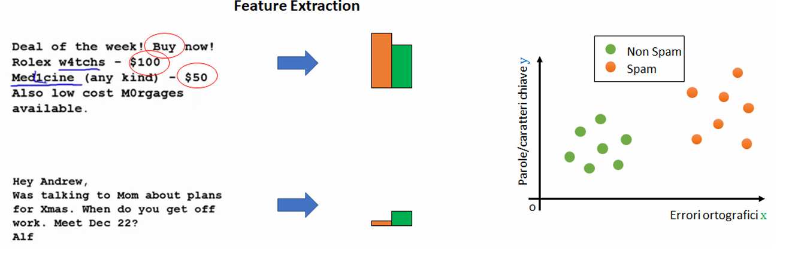

## Tipologie di Task

Le attività possono essere di diversi tipi. Di seguito, discuteremo due compiti principali:

- Classificazione
- Regressione

Assumeremo che ogni algoritmo di apprendimento automatico prenda come input esempi che sono già stati rappresentati con una funzione di rappresentazione adeguata.

## Classificazione

In questo tipo di attività, alla macchina viene chiesto di specificare a quale di un insieme predefinito di categorie K appartiene l'input.

Esempi di questo compito sono:

- Classificare i post di Facebook come riguardanti la politica o qualcos'altro (classificazione politica vs non politica).
- Rilevamento delle e-mail di spam (classificazione dello spam vs legittima delle e-mail).
- Riconoscimento dell'oggetto raffigurato in un'immagine tra 1000 oggetti diversi (riconoscimento dell'oggetto).

L'algoritmo di apprendimento è solitamente fornito con un insieme di esempi:

$$ \{x^{(1)}, x^{(2)}, ..., x^{(n)}\} \text{ dove: } x^{(j)} \in \mathbb{R}^{N} \forall j$$

e un insieme di etichette corrispondenti

$$ \{y^{(1)}, y^{(2)}, ..., y^{(n)}\} \text{ dove: } y^{(j)} \in \{1,..,k\}\forall j$$

che specificano a quale delle categorie K appartiene ogni esempio.

Ad esempio, se $y^{(j)} = 3$, allora $x^{(j)} $ appartiene alla classe "3".

Nel caso della classificazione binaria (ad esempio, spam vs non spam), $y^{(j)} \in \{0,1\} $. Per risolvere questo compito, l'algoritmo di apprendimento automatico assume la forma di una funzione:

$$ h: \mathbb{R}^{N} \rightarrow \{1, ... ,K\} $$

tale che:

$$y^{(j)} = h(x^{(j)})$$

Esempio:

- **Classification Task:** data un'e-mail, classificarla come spam o non spam.
- **Input:** esempi n-dimensionali $ x = (x_1, x_2, ..., x_n)$ contenenti le caratteristiche dell'email, come il numero di errori ortografici e l'occorrenza di parole specifiche.
- **Output:** etichette $y \in \{0,1\}$ che indicano se l'e-mail è legittima o spam.

## Regressione

In questo tipo di compito, al programma del computer viene chiesto di prevedere un valore numerico dato un input.

Esempi sono:

- Prevedere il prezzo delle case date alcune caratteristiche come la città, l'età, la zona, ecc.
- Prevedere il valore futuro delle azioni di una società dai valori di altre società o da altre statistiche sul mercato (previsione del mercato azionario).
- Conta il numero di auto presenti in un'immagine.

Analogamente alla classificazione, l'algoritmo viene fornito con esempi di training $x \in \mathbb{R}^{N}$ e con gli output desiderati $y \in \mathbb{R}$. L'algoritmo di apprendimento automatico assume la forma di una funzione $ h: \mathbb{R}^{N} \rightarrow \mathbb{R}$ tale che $y^{(j)} = h(x^{(j)})$.

Esempio:

- **Regression task:** Preidre il prezzo di una casa in base ai suoi metri quadratiPredict the price of a house from its size in square meters.
- **Input:** Dimensione della casa x (valore scalare)
- **Output:** Prezzo y.

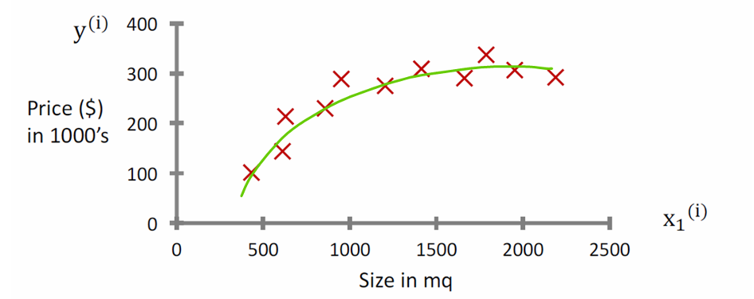

## Supervised Learning e Unsupervised Learning

Gli approcci di Machine Learning possono essere approssimativamente divisi in supervised e unsupervised learning.

Nel supervised learning, all'algoritmo vengono forniti esempi di input e i relativi output desiderati. In questo caso, il compito può essere risolto adattando una funzione ai dati, ovvero creando una funzione che restituisca quei valori. Esempi di compiti di supervised machine learning sono la classification e la regression.

Nel unsupervised learning, all'algoritmo vengono forniti solo esempi di input, senza alcuna label o output desiderato, quindi vengono forniti solo valori del tipo

$$ \{x^{(1)}, x^{(2)}, ..., x^{(n)}\} \text{ dove: } x^{(j)} \in \mathbb{R}^{N} \forall j$$

Questi tipi di compiti mirano generalmente a modellare la struttura dei dati. Un esempio di unsupervised learning è il clustering, in cui non viene fornita alcuna informazione aggiuntiva oltre agli esempi.

Gli approcci supervised sono generalmente più facili da gestire, ma richiedono la presenza di labels. Ottenere labels è spesso un problema costoso in termini di tempo, poiché richiede che le persone annotino manualmente i dati. Ad esempio, se dobbiamo costruire un spam-detector utilizzando un approccio supervised, è necessario che qualcuno etichetti manualmente diverse email come ‘spam’ o ‘non-spam’.

## Reinforcement Learning

Alcuni autori fanno riferimento anche a una terza classe di algoritmi di Machine Learning: il Reinforcement Learning.

Il Reinforcement Learning mira a scoprire la soluzione a un problema attraverso il metodo trial and error, piuttosto che tramite istruzioni esplicite su come risolvere il compito. Questo avviene permettendo all'algoritmo di interagire con un environment e ricevere positive rewards quando compie azioni che portano a un buon risultato (rispetto al problema da risolvere) e negative rewards quando compie azioni che portano a un risultato negativo.

L'obiettivo degli algoritmi di Reinforcement Learning è apprendere una policy 𝜋, che possa essere utilizzata per determinare quale azione 𝑎 intraprendere quando si acquisisce un'osservazione del mondo 𝑜. Questo processo ricorda il modo naturale in cui gli animali imparano a risolvere problemi. Ad esempio, si può pensare a un topo che deve trovare l'uscita da un labirinto.

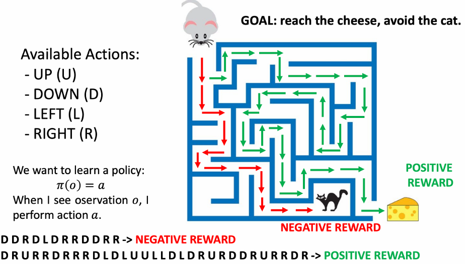

## Misura di Performance (P)

Per valutare le capacità di un algoritmo di Machine Learning nel risolvere un determinato compito, è necessaria una misura quantitativa delle sue prestazioni. Solitamente, questa performance measure \( P \) è specifica per il task \( T \) che il sistema sta eseguendo.

Per compiti come la classification, spesso si misura la performance utilizzando l'**accuracy**, ovvero la percentuale di esempi classificati correttamente dal modello. Nel caso della regression, invece, si possono usare altre metriche come il mean squared error.

Le misure di performance sono utilizzate per due motivi principali:

- Capire quando un algoritmo di Machine Learning sta migliorando in un determinato compito.
- Valutare la performance dell'algoritmo una volta finalizzato.

Una performance measure può anche essere vista in termini di error. Ad esempio, l'**accuracy** corrisponde a un error rate (la percentuale di esempi classificati in modo errato), calcolato come \( 1 - accuracy \).

### Esempio

Un spam detector analizza cinque email. Le prime tre sono spam, le ultime due non lo sono. L'algoritmo classifica come spam le prime due email e come non spam le ultime tre. In questo caso, la prima e le ultime due classificazioni sono corrette, mentre la terza è errata.

La accuracy si calcola come la percentuale di esempi classificati correttamente:

$$
\frac{4}{5} = 0.8 \quad \text{ovvero} \quad 80\%
$$

## Experience (E)

Un algoritmo di Machine Learning apprende dall'**experience** per migliorare una performance measure su un determinato task.

L'**experience** è costituita da una raccolta di esempi

$$
 \mathbf{x}^{(i)}
$$

(noti anche come data points, poiché possono essere mappati in uno spazio multi-dimensionale tramite una funzione di rappresentazione), eventualmente accompagnati dalle relative labels $$ y^{(i)} $$ (a seconda del task considerato).

Esistono due principali tipi di algoritmi di Machine Learning:

- Supervised approaches (quando abbiamo le paired labels, ad esempio nella classification e nella **regression**).
- Unsupervised approaches (quando non abbiamo paired labels, come nel **clustering**).

L'**experience** assume forme diverse a seconda del tipo di approccio di Machine Learning utilizzato.

## Dataset (D)

Le performance measures vengono generalmente calcolate rispetto a un insieme di esempi, piuttosto che su singoli esempi. Un insieme di esempi (eventualmente con labels) è chiamato **dataset**.

I datasets sono generalmente omogenei, nel senso che i dati contenuti al loro interno hanno un formato simile. Ad esempio:

- Nel Fisher’s Iris dataset, tutti gli esempi hanno 4 features e una label corrispondente a una delle tre classi.
- In un dataset di immagini di food, ogni immagine è associata a una class che indica il piatto specifico.

## Design Matrix

Un modo comune per rappresentare un dataset è utilizzare una design matrix. Poiché ogni esempio è una collezione di \( n \) features, un dataset di \( m \) elementi può essere rappresentato tramite una matrice

$$ \mathbf{X} \in \mathbb{R}^{m \times n} $$

con dimensione m x n.

- Ogni riga della design matrix rappresenta un esempio.
- Ogni colonna rappresenta una delle features.

Nel caso del supervised learning, si considera spesso anche un'altra matrice

$$ \mathbf{Y} \in \mathbb{A}^{m \times k} $$

dove \( k \) è la dimensionalità degli output desiderati.

Ad esempio, nel caso della classification,

$$ \mathbb{A} = \{1, … , M\} $$

dove \( M \) è il numero di classi e k è spesso uguale a 1.

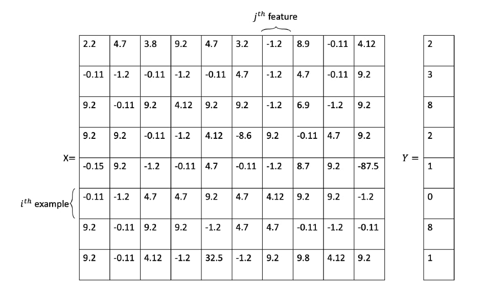

### Esempio

Supponiamo di avere un dataset composto da 1000 email, alcune classificate come spam e altre come not spam. Assumiamo che ogni email sia rappresentata da due features, come discusso nei precedenti esempi.

La design matrix che rappresenta il dataset è una matrice $$ \mathbf{X} \in \mathbb{R}^{1000 \times 2} $$

- Ogni elemento della matrice rappresenta una delle features di un esempio nel dataset.
- Ad esempio, $ X*{i,1} $ indica il numero di errori ortografici nell’**i-esima email**, mentre $ X*{j,2} $ rappresenta il numero di occorrenze di parole chiave nell’**j-esima email**, e così via.

Le labels sono contenute in un vettore $$ \mathbf{Y} \in \{0,1\}^{1000} $$ dove:

- $ Y_i $ rappresenta la label associata all’**i-esimo esempio** (ad esempio, 0 = not spam, **1 = spam**).

## Learning

Un algoritmo di Machine Learning utilizza un dataset di esempi per migliorare la sua performance in un determinato task. Il processo di miglioramento della performance dell'algoritmo è chiamato learning o training.

### Come apprende un algoritmo di Machine Learning? In cosa consiste il training?

- Un algoritmo di Machine Learning ha alcuni parametri chiamati parameters, che possono essere regolati per modificarne il comportamento. Questi parametri sono legati a un model (una funzione matematica) utilizzata per risolvere il task.
- Un algoritmo chiamato training procedure utilizza gli esempi forniti per trovare i valori ottimali per questi parameters.
- Alcuni parametri non possono essere regolati automaticamente dal training. Questi sono detti hyperparameters e devono essere ottimizzati al di fuori della training procedure, spesso attraverso un metodo trial and error.

### Esempio

Consideriamo un semplice spam detector che classifica le email come spam o non-spam in base al numero di errori ortografici.

L'algoritmo può essere scritto come segue:

```python
def classify(x):
    if x > θ:
        return 1  # Spam
    else:
        return 0  # Non-spam
```

L'algoritmo dipende da un singolo parametro θ. La domanda è: quale valore dovremmo assegnare a θ?

La training procedure permette di trovare un valore adatto per θ.

Una semplice training procedure consisterebbe nel provare diversi valori per θ e registrare le performance dell'algoritmo per ciascun valore di θ. Alla fine, possiamo scegliere il valore di θ che massimizza la performance measure P.

## The Training/Test Paradigm

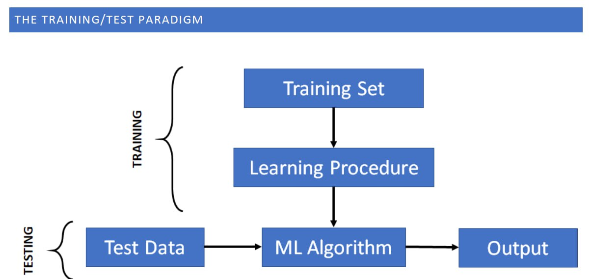

Una training procedure solitamente cerca di ottimizzare le prestazioni dell'algoritmo sui dati disponibili. Tuttavia, in generale, non c'è garanzia che, dopo il training, l'algoritmo performi bene su dati che non sono mai stati visti prima.

In pratica, ci affidiamo generalmente a due set di dati:

- Il training set, utilizzato per il training.
- Il test set, utilizzato per valutare le prestazioni dopo il training.

Pertanto, eseguiamo due processi:

- Training: utilizziamo la learning procedure per ottimizzare i parametri dell'algoritmo di Machine Learning utilizzando il training set. Questo permette di istanziare un algoritmo di Machine Learning che può essere utilizzato per elaborare nuovi dati.
- Testing: utilizziamo l'algoritmo di Machine Learning addestrato per elaborare i dati di test e valutare le prestazioni dell'algoritmo sui dati di test. Chiamiamo anche questo processo evaluation.

## Training And Test Sets

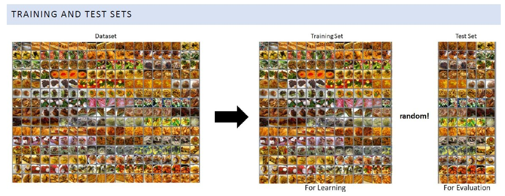

Idealmente, dovremmo addestrare gli algoritmi su un set di dati e valutarli nel mondo reale. Tuttavia, ciò può creare alcuni problemi, poiché è necessario che i dati di training e di test siano omogenei e che il processo di valutazione sia ripetibile.

Un modo conveniente per "simulare" l'esistenza di due set di dati consiste nel suddividere casualmente il dataset in un training set e un test set.

È importante suddividere il dataset in modo casuale perché non vogliamo introdurre alcun bias nel meccanismo di training/test:

- Ad esempio, i dati potrebbero essere stati acquisiti seguendo un ordine specifico (ad esempio, classe per classe).
- Poiché il nostro algoritmo di learning dovrebbe funzionare nel "mondo reale", vogliamo che sia indipendente da qualsiasi tipo di ordine.

## Training, Validation and Test Set

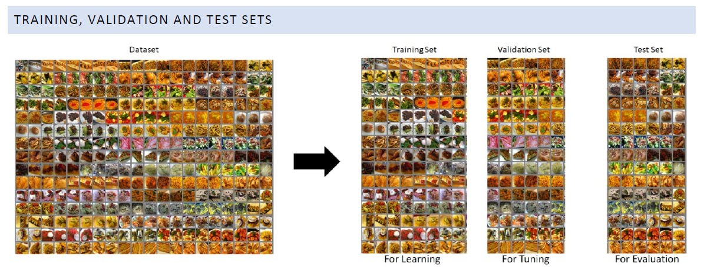

Come abbiamo accennato, gli algoritmi di Machine Learning hanno anche hyperparameters che non vengono ottimizzati durante il training. Per ottimizzare questi parametri, possiamo suddividere il dataset in tre set, solitamente chiamati training set, validation set e test set. La suddivisione viene sempre eseguita in modo casuale.

Quando si ottimizzano molti parametri, è importante avere un validation set. Infatti, vogliamo assicurarci che l'algoritmo funzioni su dati che non sono mai stati visti durante il training. Se ottimizziamo i nostri parametri sul test set, non siamo sicuri di cosa succederà quando verrà fornito un altro set di dati.

## Cross Validation

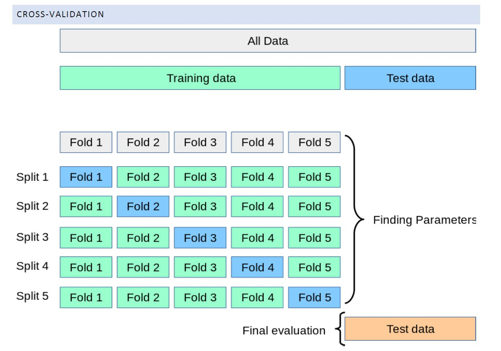

Quando abbiamo un dataset di dimensioni ridotte, suddividerlo in due o tre parti per ottenere una divisione training/validation/test può ridurre notevolmente la quantità di dati disponibili per il training.

In questi casi, risolviamo il problema utilizzando la cross-validation. Questo consiste in:

- Suddividere i dati in training set e test set.
- Suddividere ulteriormente il training set in sottoinsiemi non sovrapposti chiamati folds (ad esempio, 5).
- Poi scegliamo uno dei folds come validation fold (ad esempio, il fold 5).
- Gli altri folds verranno uniti e utilizzati per il training.
- Il processo può essere ripetuto per \( k \) volte (dove \( k \) è il numero di **folds**).
- Una volta identificata la migliore scelta di hyperparameters su tutti i folds, il modello può essere riaddestrato sull'intero training set e testato sui dati di test.

Questa procedura può essere molto dispendiosa in termini di tempo, ma funziona bene quando il dataset non è troppo grande e fornisce una buona stima degli hyperparameters del modello.

## Underfitting ed Overfitting

La sfida centrale nel Machine Learning è che il nostro algoritmo deve performare bene su nuovi input, mai visti prima non solo su quelli su cui il nostro modello è stato addestrato. La capacità di performare bene su input precedentemente non osservati è chiamata generalizzazione.

Possiamo utilizzare il training set e il test set per misurare la generalizzazione. Solitamente calcoliamo due punteggi:

- Un training error, ossia l'errore ottenuto sul training set.
- Un test error o generalization error, ossia l'errore ottenuto sul test set.

Tipicamente, vogliamo che sia l'errore di training che l'errore di test siano bassi. Tuttavia, due condizioni patologiche sono molto comuni:

- Underfitting: il modello ottiene un grande errore sia sul training che sul test set.
- Overfitting: il modello ottiene un errore ridotto sul training set e un errore elevato sul test set.

Queste due condizioni sono influenzate dalla capacità del modello. Intuitivamente, il concetto di capacità è legato alla capacità di adattarsi a molte funzioni. Ad esempio, un modello che può calcolare solo funzioni lineari ha una capacità inferiore rispetto a un modello che può modellare anche funzioni non lineari.

- I modelli con bassa capacità potrebbero avere difficoltà ad adattarsi al training set.
- I modelli con alta capacità possono sovraccaricarsi, memorizzando proprietà del training set che non sono utili per il test set.

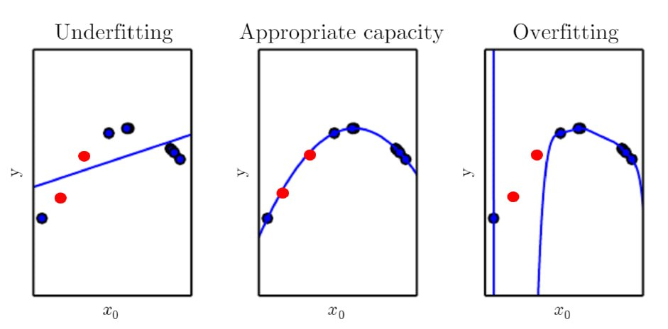

L'immagine mostra un esempio di regressione. I punti blu rappresentano i dati di training generati utilizzando una funzione quadratica. Abbiamo addestrato tre modelli sui dati:

- Il primo modello a sinistra è lineare e ha una capacità limitata. Questo porta a un underfitting, ottenendo prestazioni basse sia sul training set che sul test set (i punti rossi).
- Il secondo modello ha una capacità adeguata e recupera un buon modello per i dati.
- Il terzo modello ha una capacità maggiore e overfit i dati. Il modello si adatta bene al training set, ma non generalizza sui dati di test (i punti rossi).

## Bias e Varianza

Strettamente correlati all'**underfitting** e all'**overfitting** sono i concetti di bias e variance. Una volta che un algoritmo di Machine Learning è addestrato, le sue previsioni possono soffrire di due principali problemi:

- Bias Error: le previsioni non sono corrette a causa di assunzioni errate nel modello. Un alto bias può portare il modello a non rilevare importanti relazioni tra le features e gli output target, portando a underfitting. Ad esempio, pensa a un modello che cerca di approssimare una funzione polinomiale con una funzione lineare.

- Variance Error: le previsioni del modello sono fortemente influenzate da piccole fluttuazioni nel training set. Ad esempio, se rimuoviamo un punto dati e riaddestriamo l'algoritmo, otteniamo previsioni molto diverse. Questo può essere dovuto al fatto che l'algoritmo sta cercando di modellare il rumore casuale presente nei dati di training, il che di solito porta a overfitting.

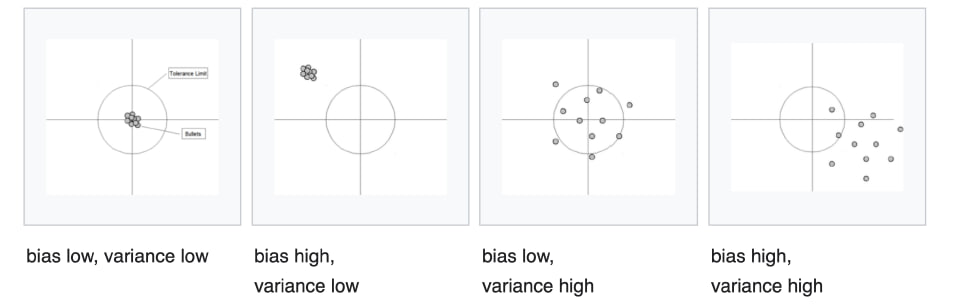

Analogamente all'**overfitting** e all'**underfitting**, anche il bias e la variance sono influenzati dalla capacità (o complessità) del modello. Pertanto, un buon modello è quello che riesce a raggiungere un buon trade-off tra bias e variance.

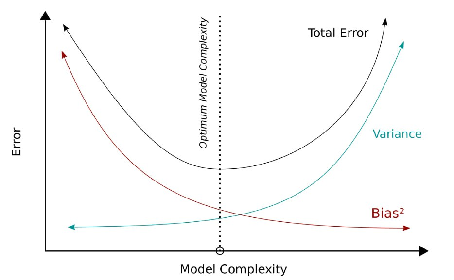
