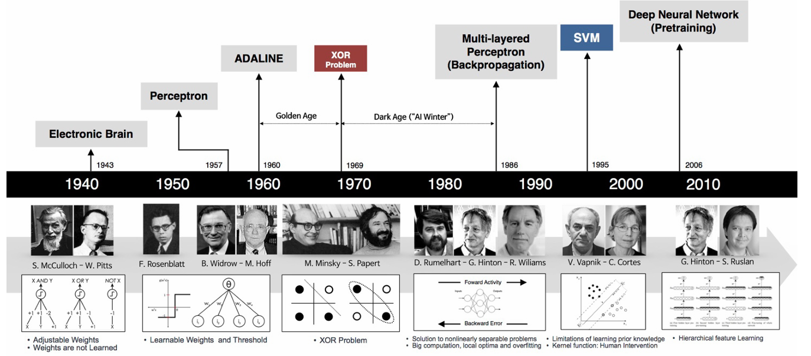
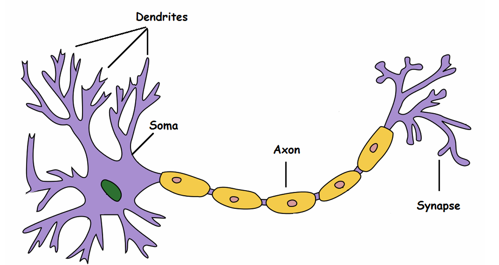

# Giovedì 13 marzo 2025

## Storia del Machine Learning basato sulle Reti Neurali

## Un modello molto semplice ed impreciso del nostro cervello

La storia del machine learning inizia con i ricercatori che cercavano di replicare il funzionamento del nostro cervello. Di conseguenza, i primi modelli di machine learning proposti si ispiravano al modo in cui funziona l'unità di calcolo fondamentale del nostro cervello: il neurone.

Possiamo vedere un neurone come una semplice macchina di calcolo che prende una serie di ingressi, li elabora e restituisce un'uscita. Le componenti principali del neurone sono:

1. **Dendriti**: permettono al neurone di ricevere molteplici ingressi.
2. **Soma**: è l'unità di elaborazione del neurone.
3. **Axon**: è il "canale di uscita" del neurone.

I neuroni possono comunicare con altri neuroni attraverso segnali elettrici, che vengono ricevuti dai dendriti e trasmessi attraverso l'assone. Questi segnali tendono ad avere solo due livelli: **alto** e **basso**. Quando un neurone emette un livello di corrente alto, si dice che il neurone è attivo; mentre è inattivo quando emette un livello di corrente basso.

Di conseguenza, possiamo pensare a un neurone come a una macchina di calcolo binaria: riceve un insieme di ingressi binari e restituisce un valore binario (0 o 1).

## Reti Neurali

Se i neuroni sono macchine così semplici, come fa il nostro cervello a funzionare?

Molti neuroni connessi tra loro formano una **"rete"**. Questa rete è collegata ai nostri organi sensoriali (ad esempio, occhi, orecchie, ecc.) per raccogliere segnali di ingresso. A seconda dei segnali osservati, alcuni neuroni si attiveranno, mentre altri rimarranno inattivi.

Gruppi di neuroni si specializzano per "attivarsi insieme" quando viene presentato un determinato input. Ad esempio, un insieme di neuroni si attiverà quando davanti all'occhio viene mostrato un segmento orizzontale, mentre altri saranno sensibili alle linee verticali.

I neuroni tendono a essere distribuiti in **strati**, con i neuroni di uno strato che comunicano principalmente con quelli negli strati superiori e inferiori. Inoltre, le connessioni si sviluppano prevalentemente dai sensi verso i neuroni situati più in alto nella gerarchia (sebbene esistano anche le cosiddette **"backward connections"**).

I neuroni più in alto nella gerarchia tendono ad attivarsi in presenza di concetti più astratti, come volti umani e categorie di oggetti.

Questo sembra suggerire che le rappresentazioni nella nostra mente siano **gerarchiche**, e che i concetti di alto livello (ad esempio, i volti umani) siano rappresentati come una **composizione** di concetti di livello inferiore (ad esempio, bordi o parti del volto umano come nasi e bocche).

## Neuroni di McCulloch-Pitts

Il primo tentativo di modellare matematicamente un neurone è stato fatto da **Warren McCulloch** (un neuroscienziato) e **Walter Pitts** (un logico), che nel 1943 proposero il **neurone di McCulloch-Pitts**.

Un neurone di McCulloch-Pitts può essere visto come un'unità che riceve **n ingressi** e restituisce **un'uscita**:

Analogamente al modello di un neurone biologico, tutti gli **ingressi e le uscite sono binari**. Il neurone è anche associato a una **soglia $$\Theta$$**. L'uscita può essere distribuita a più neuroni, creando connessioni multiple.

Gli ingressi x possono provenire da altri neuroni o rappresentare caratteristiche di un elemento in ingresso. Ogni ingresso è collegato al neurone tramite **archi direzionati** (tutti orientati dall'ingresso al neurone). Esistono due tipi di archi:

- **Eccitatori**
- **Inibitori**

Il neurone esegue un'operazione di calcolo molto semplice:

1. Supponiamo che il neurone riceva gli ingressi eccitatori $$ x_1, ..., x_m $$ e gli ingressi inibitori $$ y_1, ..., y_k $$
2. Se $$ m \geq 1 $$ e almeno uno degli ingressi inibitori è 1, allora il neurone è **inibito** e l'uscita sarà **0** .
3. Altrimenti, il livello totale di eccitazione viene calcolato sommando i valori degli ingressi eccitatori:

   $$
   S = x_1 + x_2 + \dots + x_m
   $$

Se $$ S \geq \theta $$, l'uscita sarà **1** ; altrimenti, l'uscita sarà **0**.

L'operazione di soglia può essere vista come una **funzione a gradino** che trasforma un ingresso non binario in un'uscita binaria.
