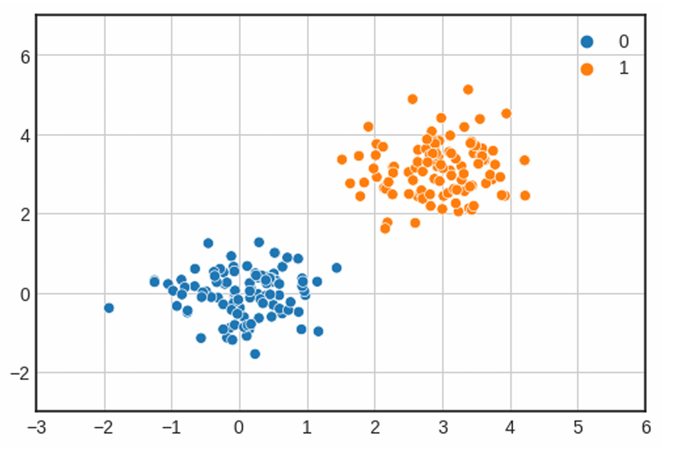
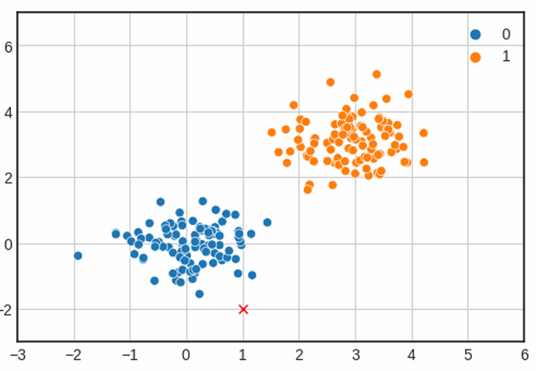
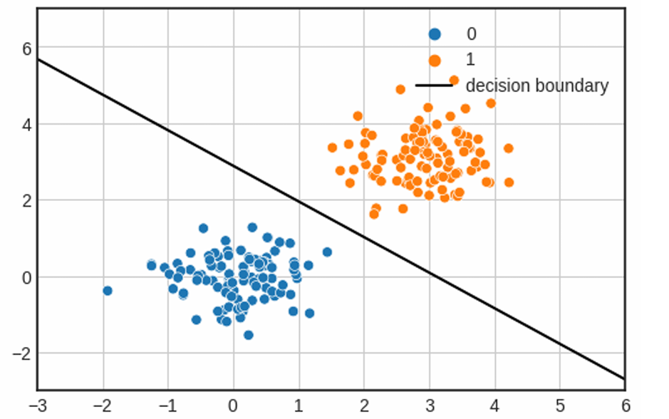
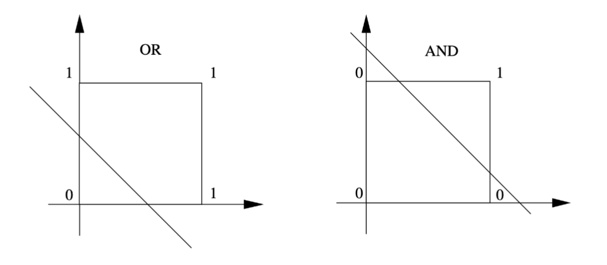
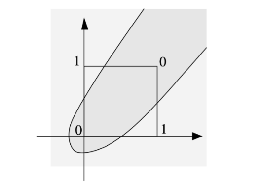

# Giovedì 13 marzo 2025

## Storia del Machine Learning basato sulle Reti Neurali

## Un modello molto semplice ed impreciso del nostro cervello

La storia del machine learning inizia con i ricercatori che cercavano di replicare il funzionamento del nostro cervello. Di conseguenza, i primi modelli di machine learning proposti si ispiravano al modo in cui funziona l'unità di calcolo fondamentale del nostro cervello: il neurone.

Possiamo vedere un neurone come una semplice macchina di calcolo che prende una serie di ingressi, li elabora e restituisce un'uscita. Le componenti principali del neurone sono:

1. **Dendriti**: permettono al neurone di ricevere molteplici ingressi.
2. **Soma**: è l'unità di elaborazione del neurone.
3. **Axon**: è il "canale di uscita" del neurone.

I neuroni possono comunicare con altri neuroni attraverso segnali elettrici, che vengono ricevuti dai dendriti e trasmessi attraverso l'assone. Questi segnali tendono ad avere solo due livelli: **alto** e **basso**. Quando un neurone emette un livello di corrente alto, si dice che il neurone è attivo; mentre è inattivo quando emette un livello di corrente basso.

Di conseguenza, possiamo pensare a un neurone come a una macchina di calcolo binaria: riceve un insieme di ingressi binari e restituisce un valore binario (0 o 1).

## Reti Neurali

Se i neuroni sono macchine così semplici, come fa il nostro cervello a funzionare?

Molti neuroni connessi tra loro formano una **"rete"**. Questa rete è collegata ai nostri organi sensoriali (ad esempio, occhi, orecchie, ecc.) per raccogliere segnali di ingresso. A seconda dei segnali osservati, alcuni neuroni si attiveranno, mentre altri rimarranno inattivi.

Gruppi di neuroni si specializzano per "attivarsi insieme" quando viene presentato un determinato input. Ad esempio, un insieme di neuroni si attiverà quando davanti all'occhio viene mostrato un segmento orizzontale, mentre altri saranno sensibili alle linee verticali.

I neuroni tendono a essere distribuiti in **strati**, con i neuroni di uno strato che comunicano principalmente con quelli negli strati superiori e inferiori. Inoltre, le connessioni si sviluppano prevalentemente dai sensi verso i neuroni situati più in alto nella gerarchia (sebbene esistano anche le cosiddette **"backward connections"**).

I neuroni più in alto nella gerarchia tendono ad attivarsi in presenza di concetti più astratti, come volti umani e categorie di oggetti.

Questo sembra suggerire che le rappresentazioni nella nostra mente siano **gerarchiche**, e che i concetti di alto livello (ad esempio, i volti umani) siano rappresentati come una **composizione** di concetti di livello inferiore (ad esempio, bordi o parti del volto umano come nasi e bocche).

## Neuroni di McCulloch-Pitts

Il primo tentativo di modellare matematicamente un neurone è stato fatto da **Warren McCulloch** (un neuroscienziato) e **Walter Pitts** (un logico), che nel 1943 proposero il **neurone di McCulloch-Pitts**.

Un neurone di McCulloch-Pitts può essere visto come un'unità che riceve **n ingressi** e restituisce **un'uscita**:

Analogamente al modello di un neurone biologico, tutti gli **ingressi e le uscite sono binari**. Il neurone è anche associato a una **soglia $\theta$**. L'uscita può essere distribuita a più neuroni, creando connessioni multiple.

Gli ingressi x possono provenire da altri neuroni o rappresentare caratteristiche di un elemento in ingresso. Ogni ingresso è collegato al neurone tramite **archi direzionati** (tutti orientati dall'ingresso al neurone). Esistono due tipi di archi:

- **Eccitatori**
- **Inibitori**

Il neurone esegue un'operazione di calcolo molto semplice:

1. Supponiamo che il neurone riceva gli ingressi eccitatori $x_1, ..., x_n$ e gli ingressi inibitori $y_1, ..., y_m$
2. Se $m \geq 1$ e almeno uno degli ingressi inibitori è 1, allora il neurone è **inibito** e l'uscita sarà **0** .
3. Altrimenti, il livello totale di eccitazione viene calcolato sommando i valori degli ingressi eccitatori:

$$
   S = x_1 + x_2 + \dots + x_n
$$

Se $S \geq \theta$, l'uscita sarà **1** ; altrimenti, l'uscita sarà **0**.

L'operazione di soglia può essere vista come una **funzione a gradino** (**Step function**) che trasforma un ingresso non binario in un'uscita binaria.

Mentre questo modello può sembrare semplice, una scelta appropriata della soglia $\theta$ permette di implementare facilmente le porte logiche **AND** e **OR**:

Questo principio si generalizza anche a più di un ingresso:

L'uso di **connessioni inibitorie** (contrassegnate da un punto all'estremità dell'arco) permette di implementare unità logiche ancora più complesse:

Pertanto, abbiamo un modello parametrico che può implementare diverse funzioni con una scelta appropriata dei parametri. I parametri in questione sono:

- La natura di ogni connessione (eccitatoria o inibitoria).
- Il valore della soglia $\theta$.

McCulloch e Pitts mostrarono anche che **impilando** diverse unità si potrebbero implementare funzioni più complesse, creando così i primi tipi di **"reti neurali artificiali"**.

## PERCEPTRON DI ROSENBLATT

Il neurone di McCulloch-Pitts ha diverse limitazioni:

1. È progettato per gestire solo ingressi binari e eseguire operazioni logiche. Pertanto, non è adatto per l'uso con caratteristiche arbitrarie (ad esempio, numeri reali o interi).
2. I parametri sono fissi e devono essere scelti manualmente. Ciò significa che possiamo adattare il modello per risolvere problemi diversi, ma dobbiamo sapere qual è la soluzione logica del problema per farlo. Idealmente, vorremmo essere in grado di trovare la scelta appropriata per i parametri automaticamente (con una procedura di apprendimento) osservando una serie di esempi.
3. Sono tutti gli ingressi uguali? Non possiamo assegnare importanza ai diversi ingressi.
4. Tutte le funzioni calcolate sono **linearmente separabili**.

Nel 1958, **Rosenblatt** propose il **"perceptron"**, un modello simile che supera alcune delle limitazioni in due modi:

- **Assegnando pesi** alle connessioni. Questi pesi verranno moltiplicati per i valori di ingresso. Poiché i pesi negativi sono possibili, non c'è bisogno di distinguere tra connessioni eccitatorie e inibitorie.
- **Fornendo un algoritmo di apprendimento efficace** per il perceptron che può trovare i pesi appropriati del modello (i pesi sono parametri del modello) se esistono.

Il perceptron può essere illustrato come segue:

Qui, $x_1, x_2, x_3, ..., x_n$ sono gli ingressi (che possono essere binari, interi o reali), $w_1, w_2, w_3, ..., w_n$ sono i pesi associati agli ingressi, e $w_0$ è un peso aggiuntivo che funge da soglia (denotato come $\theta$ nel modello di McCulloch-Pitts).

Il simbolo $\Sigma$ indica che il modello esegue una somma dei valori di ingresso moltiplicati per i pesi, più il termine di **bias**. La **step function** decide se il neurone deve attivarsi o meno.

Il calcolo eseguito da questo modello può essere scritto come segue:

$$
f(\mathbf{x}) =
\begin{cases}
1 & \text{se } \sum_{i=1}^n x_i w_i > w_0 \\
0 & \text{altrimenti}
\end{cases}
$$

Se introduciamo un ingresso aggiuntivo "dummy" $x_0 = 1$, la somma pesata può essere semplificata come $\sum_{i=0}^n x_i w_i$, e il modello può essere riscritto come:

$$
f(\mathbf{x}) =
\begin{cases}
1 & \text{se } \sum_{i=0}^n x_i w_i > 0 \\
0 & \text{altrimenti}
\end{cases}
$$

Nota che, sebbene si possa pensare che il segno di $w_0$ debba essere invertito nella trasformazione sopra, questo non è necessario perché $w_0$ è un peso che deve essere appreso (impareremo eventualmente un valore negativo se necessario).

Possiamo anche scrivere il modello in forma compatta come segue:

$$
f(\mathbf{x}) = [ \mathbf{w}^T \mathbf{x} > 0 ]
$$

Dove $[.]$ denota la **parentesi di Iverson**:

$$
[Z] =
\begin{cases}
1 & \text{se } Z \text{ è vero} \\
0 & \text{altrimenti}
\end{cases}
$$

Dove $\mathbf{w} = (w_1, w_2, ..., w_n)$ e $\mathbf{x} = (x_1, x_2, ..., x_n)$.

## Interpretazione Geometrica

I perceptron prendono come ingresso **vettori di features** e restituiscono **valori binari**. Pertanto, possono essere visti come **classificatori binari**, e questo è stato effettivamente il primo utilizzo dei perceptron mai dimostrato.

Consideriamo un dataset di esempi con **due caratteristiche reali** distribuite come mostrato di seguito:

Ogni esempio (noto anche come **punto dati**) $\mathbf{x} = (x_1, x_2)$ è mostrato nel grafico come un punto bidimensionale nel **spazio cartesiano**. I punti appartengono a due classi: "0" (blu) e "1" (arancione).

Un perceptron può risolvere questo problema di classificazione binaria trovando i valori appropriati per i tre parametri (numero di dimensioni + 1 parametro per la soglia):

$$
w_0, w_1, w_2
$$

Se alleniamo un perceptron su questi dati (ne parleremo più avanti sull'algoritmo di apprendimento), potremmo ottenere la seguente soluzione per i pesi:

$$
w_0 = -5.74, \quad w_1 = 1.86, \quad w_2 = 1.99
$$

Consideriamo ora un nuovo punto con caratteristiche $(1, -2)$, mostrato di seguito come una **croce rossa**:

Per questo nuovo ingresso, il perceptron calcolerà il seguente valore:

$$
f(1, -2) =
\begin{cases}
1 & \text{se } -5.74 + 1.86 \cdot 1 + 1.99 \cdot (-2) > 0 \\
0 & \text{altrimenti}
\end{cases}
$$

$$
f(1, -2) =
\begin{cases}
1 & \text{se } -7.86 > 0 \\
0 & \text{altrimenti}
\end{cases}
$$

Quindi, l'output sarà **0**. Questo è un risultato ragionevole, considerando che la croce rossa è più vicina ai punti blu che a quelli arancioni.

Idealmente, possiamo eseguire questo calcolo su un insieme casuale di punti campionati dallo spazio, se vogliamo sapere come il perceptron si comporta sull'intero spazio che stiamo osservando nel diagramma sopra.

In pratica, tuttavia, possiamo osservare che la classe predetta sarà positiva per l'insieme di punti 2D che soddisfano la seguente disuguaglianza:

$$
w_0 + w_1 x_1 + w_2 x_2 > 0
$$

Mentre il perceptron classificherà come esempi negativi i punti 2D che soddisfano la disuguaglianza:

$$
w_0 + w_1 x_1 + w_2 x_2 < 0
$$

Notiamo che il classificatore sarà massimamente incerto quando:

$$
w_0 + w_1 x_1 + w_2 x_2 = 0
$$

O equivalentemente,

$$
x_2 = -\frac{w_1}{w_2}x_1 - \frac{w_0}{w_2}
$$

sostituendo

$$
w_0 = -5.74, \quad w_1 = 1.86, \quad w_2 = 1.99
$$

otteniamo:

$$
x_2 = -0.95 x_1 + 2.88
$$

Questa è l'equazione di una retta in uno spazio 2D. Se tracciamo questa retta sui dati, otteniamo il seguente grafico:

In pratica, il perceptron separa lo spazio in due aree:

- Tutti i punti sopra la retta soddisfano la disuguaglianza $w_0 + w_1 x_1 + w_2 x_2 > 0$ e saranno classificati come esempi positivi.
- Tutti i punti sotto la retta soddisfano la disuguaglianza $w_0 + w_1 x_1 + w_2 x_2 < 0$ e saranno classificati come esempi negativi.
- Per tutti i punti che soddisfano l'equazione $w_0 + w_1 x_1 + w_2 x_2 = 0$, il modello è massimamente incerto. In questo caso, i punti possono essere classificati sia come positivi che come negativi (è comunque una scelta casuale).

La retta che abbiamo tracciato sopra è chiamata **confine di decisione**, poiché indica come il classificatore ha diviso lo spazio in aree.

Mentre abbiamo visto un esempio in 2D, questo ragionamento si estende a più dimensioni. In generale, il confine di decisione è un **iperpiano** nello spazio n-dimensionale. Per esempio, in 3D, potremmo avere un confine di decisione come questo:

## Algoritmo di Learning

L'innovazione principale di Rosenblatt fu quella di fornire una procedura di addestramento per il percettrone. L'approccio proposto segue un processo iterativo in cui i parametri del modello vengono inizialmente assegnati in modo casuale, per poi essere modificati al fine di ridurre il numero di errori commessi sui dati di addestramento. Il processo viene ripetuto in modo iterativo fino a quando non vengono più commessi errori.

Più nello specifico, l’algoritmo funziona nel seguente modo:

1. **Inizializza i pesi casualmente** con piccoli valori nell'intervallo $[0,1]$ e imposta una soglia casuale nell'insieme dei numeri reali $\mathbb{R}$:

   - $ w_i\leftarrow \text{RANDOM}([0,1])$
   - $w_0 \leftarrow \text{RANDOM}(\mathbb{R})$

2. **Per ogni esempio $ i $** nel dataset di addestramento, esegui i seguenti passi sull’input $\mathbf{x}^{(i)}$:

   - Calcola l’etichetta predetta:  
     $\hat{y}^{(i)} = f(\mathbf{x}^{(i)})$ (dove $ f $ è il percettrone)
   - Aggiorna i pesi:  
     $w_j = w_j + \eta (y^{(i)} - \hat{y}^{(i)}) x_j^{(i)}$, per tutte le feature $j = 0, \ldots, n$ (dove $\eta$ è il learning rate)

3. **Ripeti il punto 2** finché non vengono più commessi errori.

Il _learning rate_ regola l’ampiezza dell’aggiornamento dei pesi. Un valore grande permetterà al modello di apprendere più “velocemente”, ma se è troppo grande può causare la divergenza della soluzione.

È dimostrato che questo algoritmo converge a una soluzione se i punti di input sono linearmente separabili. Se non lo sono, l’algoritmo non convergerà mai poiché non riuscirà a trovare una soluzione che porti a zero errori.

## Variazione Adaline

L’algoritmo descritto in precedenza utilizza la differenza tra l’output del percettrone predetto e quello reale $(y^{(i)} - \hat{y}^{(i)})$ per aggiornare i pesi.  
L’algoritmo **ADALINE** (Adaptive Linear Neuron) utilizza lo stesso schema generale, ma **impiega la differenza tra la somma pesata degli input (prima della soglia)** e l’output desiderato.

Per questo motivo, la **regola di aggiornamento dei pesi** diventa:

$$
w_j = w_j + \eta \left( y^{(i)} - \sum_{j=0}^{n} w_j x_j^{(i)} \right) x_j^{(i)}
$$

Questa formulazione permette di **controllare l'entità degli aggiornamenti dei pesi** in base a quanto la somma pesata si discosta dal valore desiderato, ovvero da quanto la predizione è “lontana” dalla soglia di attivazione.

In sintesi, mentre il percettrone si basa sull’errore _dopo_ la funzione di soglia, ADALINE lavora _prima_ di essa, rendendo l’algoritmo più stabile e adatto all’uso con tecniche di discesa del gradiente.

## XOR Problem

Abbiamo visto che una scelta appropriata dei pesi permette a un percettrone di trovare un iperpiano che separa i dati in due classi.  
Tuttavia, **cosa succede se i punti non possono essere separati da una linea?**

Per capire cosa accade in questo caso, consideriamo il problema di implementare alcune funzioni booleane.  
Osserviamo la seguente tabella, che mostra i risultati delle operazioni **AND**, **OR** e **XOR**:

| x   | y   | AND | OR  | XOR |
| --- | --- | --- | --- | --- |
| 0   | 0   | 0   | 0   | 0   |
| 0   | 1   | 0   | 1   | 1   |
| 1   | 0   | 0   | 1   | 1   |
| 1   | 1   | 1   | 1   | 0   |

Possiamo interpretare il problema di prevedere i valori di **AND**, **OR** e **XOR** a partire dagli input x e y come tre diversi problemi di classificazione binaria.

È facile vedere che i percettroni **riescono a trovare soluzioni (confini di decisione lineari - linear decision boundaries)** per le funzioni **AND** e **OR**.  
Infatti, in questi due casi i dati sono linearmente separabili: esiste una retta (o iperpiano in spazi di dimensione superiore) che separa perfettamente i punti positivi da quelli negativi.

Tuttavia, come vedremo nel caso della **XOR**, il problema non è linearmente separabile, e quindi **un singolo percettrone non è sufficiente** a risolverlo.

La figura mostra un possibile confine di decisione che è chiaramente **non lineare**.  
Tale confine **non può essere calcolato da un percettrone**, poiché **non è possibile rappresentarlo** scegliendo opportunamente i pesi per l’inequazione:

$$
w_1 x_1 + w_2 x_2 + w_0 > 0
$$

Questo esempio suggerisce che **i percettroni non possono risolvere tutti i tipi di problemi**. Infatti, un percettrone è un **classificatore lineare** e può risolvere **solo problemi in cui i dati di addestramento sono linearmente separabili**.

La **linearità** può essere definita nel seguente modo:

Due insiemi di punti $A$ e $B$ in uno spazio n-dimensionale si dicono **linearmente separabili** se esistono $n + 1$ numeri reali $w_1, \ldots, w_n, w_0$, tali che:

- ogni punto $(x_1, x_2, \ldots, x_n) \in A$ soddisfa

  $$
  \sum_{i=1}^{n} w_i x_i \geq w_{n+1}
  $$

- e ogni punto $(y_1, y_2, \ldots, y_n) \in B$ soddisfa

  $$
  \sum_{i=1}^{n} w_i y_i < w_{n+1}
  $$

Nel **1969**, **Minsky e Papert** dimostrarono che **il problema della XOR non può essere risolto da un percettrone**.  
Questo è uno degli esempi classici che ha evidenziato i limiti dei percettroni semplici, portando alla nascita di modelli più complessi, come le **reti neurali multilivello (MLP)**, capaci di apprendere anche relazioni non lineari.
