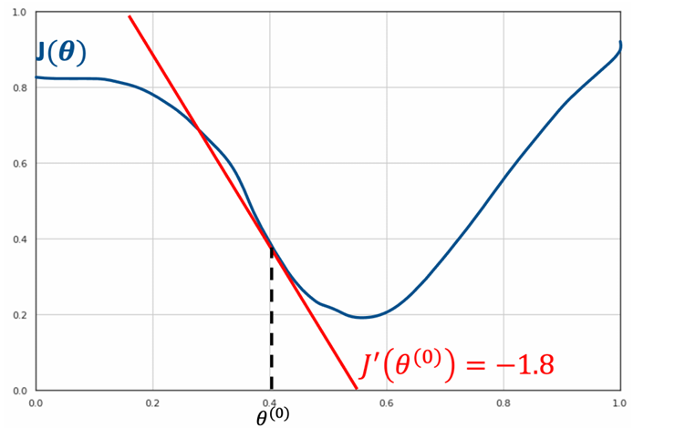
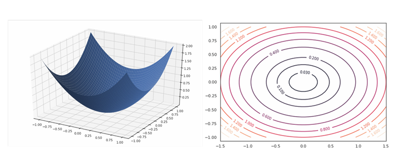

# Venerdì 14 marzo 2025

## COMPITI DI REGRESSIONE

Definiremo il compito di regressione in termini di come l'algoritmo di regressione elabora un determinato esempio di input.

## Definizione del Task

Definiamo un regressore come una funzione:

$$
f: \mathbb{R}^n \rightarrow \mathbb{R}^m
$$

dove $n$ è la dimensionalità dello spazio di input e $m$ è la dimensionalità dello spazio di output.

In generale, denoteremo il vettore di input con $\mathbf{x} \in \mathbb{R}^n$, il vettore di output vero (ground truth) con $\mathbf{y} \in \mathbb{R}^m$, e il vettore di output predetto con $\hat{\mathbf{y}} \in \mathbb{R}^m$.

Possiamo predire un valore da $\mathbf{x}$ nel seguente modo:

$$
\hat{\mathbf{y}} = f(\mathbf{x})
$$

In questo contesto, $\mathbf{x}$ è spesso chiamata **variabile indipendente** e $\mathbf{y}$ **variabile dipendente**.

## Trovare la funzione di regressione $f$

Useremo il paradigma dell'apprendimento automatico per apprendere un regressore adatto $f$. A tal fine, una volta definito il nostro compito, dobbiamo definire un insieme di dati adatto per addestrare e testare i nostri algoritmi. Discuteremo le misure di performance in seguito.

Assumiamo di avere un dataset $D$ di coppie di dati etichettati:

$$
D = \{ ( x^{(j)}, y^{(j)} ) \}_j
$$

Ogni coppia di dati $( x^{(j)}, y^{(j)} )$ è composta da un campione di input $x^{(j)} \in \mathbb{R}^n$ e un valore etichetta di verità $y^{(j)} \in \mathbb{R}^m$. Assumiamo che il dataset sia stato diviso in tre diversi insiemi:

- Un insieme di addestramento $TR = \{ ( x^{(j)}, y^{(j)} ) \}_j$
- Un insieme di validazione $VA = \{ ( x^{(j)}, y^{(j)} ) \}_j$
- Un insieme di test $TE = \{ ( x^{(j)}, y^{(j)} ) \}_j$

---

### Misure di performance

Secondo il paradigma del machine learning, dobbiamo definire una misura per valutare la performance di un dato algoritmo di regressione. Similmente al caso della classificazione, considereremo l'insieme delle etichette di test reali:

$$
Y_{TE} = { y^{(i)} \mid ( x^{(i)}, y^{(i)} ) \in TE }
$$

e l'insieme delle etichette di test previste:

$$
\hat{Y}_{TE} = \{ f(x^{(i)}) \mid ( x^{(i)}, y^{(i)} ) \in TE \}
$$

Idealmente, vorremmo che le etichette previste coincidessero con quelle reali, cioè $\hat{Y}_{TE} = Y_{TE}$ In pratica, definiremo una misura di performance per valutare quanto le nostre previsioni siano vicine ai valori reali.

---

## Errore Quadratico Medio (MSE)

Consideriamo un'etichetta reale $y \in \mathbb{R}^m$ e un'etichetta prevista $\hat{y} \in \mathbb{R}^m$. Dato che entrambi i valori sono vettori di dimensione $m$, un modo naturale per misurare se $\hat{y}$ è una buona approssimazione di $y$ è semplicemente misurare la loro distanza euclidea:

$$
\| \hat{y} - y \|_2 = \sqrt{ \sum_{i=1}^{m} (\hat{y}_i - y_i)^2 }
$$

In pratica, utilizziamo spesso la distanza euclidea al quadrato per penalizzare maggiormente gli errori grandi:

$$
\text{error}(\hat{y}, y) = \| \hat{y} - y \|_2^2 = \sum_{i=1}^{m} (\hat{y}_i - y_i)^2
$$

Possiamo calcolare l’errore medio su tutto l’insieme di test per ottenere un indicatore di performance, che viene solitamente chiamato **Errore Quadratico Medio (MSE)**:

$$
\text{MSE}(Y_{TE}, \hat{Y}_{TE}) = \frac{1}{|TE|} \sum_{j=1}^{|TE|} \| \hat{y}^{(j)} - y^{(j)} \|_2^2
$$

Questa misura di performance è in realtà una **misura di errore**. Un buon regressore otterrà un errore piccolo.

## Casi speciali di regressione

Mentre la **regressione** può essere in generale definita come il problema di mappare vettori in vettori tramite una funzione

$$
f: \mathbb{R}^n \rightarrow \mathbb{R}^m
$$,

alcuni **casi speciali**, ottenuti considerando valori particolari di $n$ e $m$, sono particolarmente comuni da incontrare nella pratica e per questo motivo hanno **nomi specifici**. Li riassumiamo nel seguente:

## Regressione semplice
Quando $n = m = 1$, il compito di regressione consiste nel mappare **numeri scalari** in **numeri scalari** tramite una funzione:
$$f: \mathbb{R} \rightarrow \mathbb{R}$$
In questo caso, il problema prende il nome di **regressione semplice**.

**Esempio:**
Predire il prezzo di una casa a partire dalla **superficie in metri quadrati**.

## Regressione multipla
Quando $n > 1$ e $m = 1$, il compito di regressione consiste nel mappare **vettori** in **numeri scalari** tramite una funzione:
$$f: \mathbb{R}^n \rightarrow \mathbb{R}$$
In questo caso, il problema prende il nome di **regressione multipla**.

**Esempio:**
Predire il prezzo di una casa a partire dalla **superficie in metri quadrati** e dal **numero di stanze**. In questo caso, $n = 2$.

## Regressione multivariata
Quando $m > 1$ (e $n$ è arbitrario), il compito di regressione consiste nel mappare **scalari o vettori** in **vettori** tramite una funzione:
$$f: \mathbb{R}^n \rightarrow \mathbb{R}^m$$
In questo caso, il problema prende il nome di **regressione multivariata**.

**Esempio:**
Predire la **posizione GPS** da cui è stata catturata un'immagine. In questo caso, $m = 2$.

## Regressione Lineare

Consideriamo un **semplice dataset**. I dati consistono in **coppie di numeri** $(x, y)$ che rappresentano:

- $x$: il **numero medio di stanze** delle case in un certo **sobborgo**;
- $y$: il **prezzo medio** delle case in quel sobborgo, espresso in **migliaia di dollari** ($1000\$$)
  *(cioè, ad esempio, $y = 30$ significa $30.000\$$).*

La figura sottostante mostra c **grafico** dei punti $(x, y)$.
Il nostro obiettivo è trovare una funzione $f$ che permetta di mappare il **numero medio di stanze** $x$ nel **prezzo medio** $y$.

Se osserviamo i punti nel grafico, notiamo che seguono un andamento lineare, ovvero sono approssimativamente distribuiti lungo una retta, come mostrato nel grafico seguente:

## Definizione

Nel precedente esempio, abbiamo osservato che i punti sono **approssimativamente distribuiti in modo lineare**. Possiamo quindi pensare di definire la nostra **funzione di regressione** $f$ utilizzando la **formulazione analitica di una retta**:

$$

f(x) = \theta_0 + \theta_1 x

$$

dove:
- $\theta_1$ è il **coefficiente angolare** (quanto varia $y$ all'aumentare di $x$),
- $\theta_0$ è l'**intercetta** (il valore di $y$ quando $x = 0$).

La funzione $f$ così definita prende il nome di **modello lineare** o **regressore lineare**.
I valori $\theta_0$ e $\theta_1$ sono i **parametri** del modello.

Apprendere un regressore lineare significa **trovare i valori dei parametri** $\theta_0$ e $\theta_1$ tali che $f(x)$ sia una buona **predizione** di $y$. Vedremo più avanti un **algoritmo** per determinare questi valori ottimali.

## Esempio di Regressione Lineare

Consideriamo il nostro precedente esempio di **regressione semplice**, in cui vogliamo **predire il prezzo medio** delle case a partire dal **numero medio di stanze**.

Immaginiamo, per ora, che qualcuno ci abbia fornito una coppia di valori **già ottimizzati** per risolvere il problema di regressione:

- $\theta_1 = 9.10$
- $\theta_0 = -34.67$

Allora il nostro **modello lineare** sarà:

$$

f(x) = 9.10 \cdot x - 34.67

$$

Se tracciamo questa retta sui dati, otteniamo un grafico simile al seguente, dove la **linea stimata** segue l'**andamento dei punti** nel dataset.

## Regressione Lineare Multipla

Possiamo estendere facilmente il modello di **regressione lineare semplice** al caso della **regressione multipla**, ovvero il caso in cui vogliamo trovare una funzione del tipo:

$$

f: \mathbb{R}^n \rightarrow \mathbb{R}

$$

In questo caso, useremo **un parametro per ciascuna dimensione** della variabile di input, **più un parametro per l’intercetta**. La funzione lineare assumerà la forma:

$$

f(\mathbf{x}) = \theta_0 + \theta_1 x_1 + \theta_2 x_2 + \dots + \theta_n x_n

$$

I **parametri del modello** sono quindi:
$$

\boldsymbol{\Theta} = (\theta_0, \theta_1, \dots, \theta_n)

$$

**Apprendere il regressore** significa trovare valori adatti per i parametri $\boldsymbol{\Theta}$.

---

Per **semplificare la notazione**, possiamo **includere l’intercetta** $\theta_0$ nel prodotto scalare, definendo:

- $x_0 = 1$
- $\mathbf{x} = (x_0, x_1, \dots, x_n)$
- $\boldsymbol{\Theta} = (\theta_0, \theta_1, \dots, \theta_n)$

e scrivere il modello come:

$$

f(\mathbf{x}) = \sum\_{j=0}^n \theta_j x_j = \boldsymbol{\Theta}^\top \mathbf{x}

$$

> Nota che questo modello è **essenzialmente un perceptron**, ma **senza l’operazione di soglia** (funzione di attivazione).

## Regressione Lineare Multivariata

Consideriamo ora il **caso generale di regressione multivariata**, in cui vogliamo mappare **vettori in vettori**:

$$

f: \mathbb{R}^n \rightarrow \mathbb{R}^m

$$

La **regressione lineare multivariata** risolve il problema definendo **$m$ regressori multipli indipendenti** $f_i(\mathbf{x})$, che elaborano lo stesso input $\mathbf{x}$, ma che sono autorizzati ad avere **pesi differenti**:

$$

\begin{bmatrix}
y_1 \\
\vdots \\
y_m
\end{bmatrix}
=
\begin{bmatrix}
f_1(\mathbf{x}) \\
\vdots \\
f_m(\mathbf{x})
\end{bmatrix}

$$

Ogni regressore $f_i(\mathbf{x})$ ha i propri **parametri**, e le loro **ottimizzazioni vengono eseguite in modo indipendente**.

## Learning

Ci concentriamo sulla **forma generale della regressione lineare multipla**:

$$

f\_{\theta}(\mathbf{x}) = \theta_0 + \theta_1 x_1 + \dots + \theta_n x_n

$$

dove $f_{\theta}$ indica che $f$ **dipende dai parametri** $\boldsymbol{\Theta} = (\theta_0, \dots, \theta_n)$.

**Apprendere il regressore** $f$ significa **trovare i valori dei parametri** $\boldsymbol{\Theta}$ che **minimizzano l’errore sul training set**.

Possiamo quantificare l’errore complessivo del regressore sul set di training definendo la seguente **funzione di costo**:

$$
J(\boldsymbol{\Theta}) = \frac{1}{2m} \sum_{i=1}^{m} \left( f_{\boldsymbol{\Theta}}(\mathbf{x}^{(i)}) - y^{(i)} \right)^2
$$

> Nota che l’espressione sopra è **simile all’errore MSE** (Mean Squared Error), calcolato sul training set per una certa scelta dei parametri $\boldsymbol{\Theta}$.

Idealmente, vorremmo che il **costo fosse uguale a zero**, il che significherebbe che abbiamo un **errore quadratico medio nullo** sul set di training.

Quindi, una **buona scelta** dei parametri $\boldsymbol{\Theta}$ è quella che **minimizza la funzione di costo** $J(\boldsymbol{\Theta})$, ovvero:

$$
\boldsymbol{\Theta}^* = \underset{\boldsymbol{\Theta}}{\arg\min} \; J(\boldsymbol{\Theta})
$$

## Algoritmo del Gradiente Discendente

Abbiamo visto che possiamo trovare valori adeguati per $\boldsymbol{\Theta}$ risolvendo il problema di ottimizzazione:

$$

\boldsymbol{\Theta} = \underset{\boldsymbol{\Theta}}{\arg\min} \; J(\boldsymbol{\Theta})

$$

Tuttavia, rimane poco chiaro **come eseguire questa scelta**. Se conosciamo le **derivate parziali** della funzione rispetto a tutte le variabili, possiamo definire un sistema di equazioni impostando tutte queste derivate uguali a zero. Tuttavia, questo non è sempre praticabile, poiché, in generale, possiamo avere **molti parametri** e non conoscere la forma analitica di tutte le derivate.

In alternativa, potremmo calcolare $J(\boldsymbol{\Theta})$ per tutti i possibili valori di $\boldsymbol{\Theta}$ e scegliere i valori che minimizzano il costo. Tuttavia, questa opzione è **non praticabile** in quanto $\boldsymbol{\Theta}$ può assumere un **numero infinito di valori**.
Pertanto, abbiamo bisogno di un metodo per trovare i valori di $\boldsymbol{\Theta}$ che minimizzano $J(\boldsymbol{\Theta})$ senza dover calcolare $J(\boldsymbol{\Theta})$ per tutte le possibili scelte di $\boldsymbol{\Theta}$.

Per risolvere questo problema, possiamo usare **diverse strategie di ottimizzazione**. Vedremo una strategia numerica chiamata **discesa del gradiente**, che consente di minimizzare funzioni differenziabili rispetto ai loro parametri.

---

L’algoritmo di **discesa del gradiente** si basa sull'osservazione che, se una funzione $J(\theta)$ è definita e differenziabile in una **vicinanza di un punto** $\theta^{(0)}$, allora $J(\theta)$ diminuisce più velocemente se ci si muove da $\theta^{(0)}$ verso la direzione della **derivata negativa** di $J$ calcolata in $\theta^{(0)}$.

Immagina la funzione $J(\theta)$ come mostrato nel grafico seguente:

Assumiamo di essere nel punto iniziale $\theta^{(0)}$. Dal grafico, possiamo osservare che dovremmo muoverci verso **destra** lungo l'asse delle $x$ per raggiungere il **minimo** della funzione.

La **derivata prima** della funzione in quel punto $J'(\theta^{(0)})$ sarà uguale al **coefficiente angolare** della **tangente** alla curva nel punto $(\theta^{(0)}, J(\theta^{(0)}))$. Poiché la curva è **decrescente** in un intorno di $\theta^{(0)}$, la retta tangente sarà anch'essa decrescente. Pertanto, il **coefficiente angolare** $J'(\theta^{(0)})$ sarà negativo.

Se vogliamo **muoverci verso destra**, dobbiamo seguire la **direzione opposta** alla derivata della curva in quel punto.

La **discesa del gradiente** è un algoritmo **iterativo**; quindi, non stiamo cercando di raggiungere il minimo della funzione in un solo passo. Piuttosto, vorremmo spostarci verso un altro punto $\theta^{(1)}$ tale che:

$$

J(\theta^{(1)}) < J(\theta^{(0)})

$$

Se riusciamo a farlo per ogni punto, possiamo raggiungere il minimo in un certo numero di passi.

Ad ogni passo, ci sposteremo **proporzionalmente** al valore della derivata. Questo si basa sull'osservazione che valori assoluti maggiori della derivata indicano curve più ripide. Se scegliamo un fattore di moltiplicazione $\gamma$ (Learning rate), ci sposteremo al punto:

$$

\theta^{(1)} = \theta^{(0)} - \gamma \cdot J'(\theta^{(0)})

$$

Ad esempio, se scegliamo $\gamma = 0.02$, ci sposteremo al punto:

$$

\theta^{(1)} = 0.4 + 0.02 \cdot 1.8 = 0.436

$$

La procedura funziona **iterativamente** fino a quando la derivata è così piccola che non è più possibile spostarsi, come mostrato nel grafico seguente.

Nel passo successivo, calcoliamo la derivata della funzione nel punto corrente $J'(\theta^{(1)}) = -0.8$ e ci spostiamo al punto:

$$

\theta^{(2)} = \theta^{(1)} - \gamma \cdot J'(\theta^{(1)})

$$

Nel passo successivo, calcoliamo la derivata della funzione nel punto corrente $J'(\theta^{(2)}) = -0.4$ e ci spostiamo al punto:

$$

\theta^{(3)} = \theta^{(2)} - \gamma \cdot J'(\theta^{(2)})

$$

Calcoliamo quindi la derivata nel punto corrente $J'(\theta^{(3)}) \approx 0$.

Questa derivata è così piccola che non possiamo avanzare ulteriormente. Siamo in un minimo locale. L'ottimizzazione termina qui. Abbiamo trovato il valore $\theta^{(3)} = \underset{\theta}{\arg\min} J(\theta)$.

In pratica, l'algoritmo termina seguendo un dato criterio di terminazione. Due criteri comuni sono:
- Viene raggiunto un numero massimo di iterazioni.
- Il valore $\gamma J'(\theta)$ scende al di sotto di una soglia prestabilita.

## ONE VARIABLE
L'algoritmo della discesa del gradiente può essere scritto nella seguente forma nel caso di una sola variabile:
1. Scegli un punto iniziale casuale $\theta$;
2. Calcola la prima derivata della funzione $J'(\theta)$ nel punto corrente $\theta$;
3. Aggiorna la posizione del punto corrente usando la formula:
   $$ \theta = \theta - \gamma J'(\theta); $$
4. Ripeti i passi 2-3 fino a quando non vengono soddisfatti i criteri di terminazione.

## MULTIPLE VARIABLES
L'algoritmo della discesa del gradiente si generalizza al caso in cui la funzione $J$ da ottimizzare dipende da più variabili $J(\theta_1, \theta_2, \dots, \theta_n)$.

Ad esempio, consideriamo una funzione di due variabili $J(\theta_1, \theta_2)$. Possiamo rappresentare questa funzione come un grafico 3D (a sinistra) o come un grafico a contorni (a destra). In entrambi i casi, il nostro obiettivo è raggiungere il punto con il valore minimo (il "centro" dei due grafici).

Dato un punto $\theta = (\theta_1, \theta_2)$, la direzione di discesa più ripida è il **gradiente** della funzione nel punto.

Il **gradiente** è una generalizzazione multivariata della derivata. Il gradiente di una funzione di $n$ variabili, calcolato in un punto $\boldsymbol{\theta}$, è un vettore il cui $i$-esimo elemento è dato dalla derivata parziale della funzione rispetto alla $i$-esima variabile:

$$

\nabla J(\boldsymbol{\theta}) =
\begin{bmatrix}
\frac{\partial J}{\partial \theta_1}(\boldsymbol{\theta}) \\
\frac{\partial J}{\partial \theta_2}(\boldsymbol{\theta}) \\
\vdots \\
\frac{\partial J}{\partial \theta_n}(\boldsymbol{\theta})
\end{bmatrix}

$$

Nel caso di due variabili, il gradiente sarà un vettore 2D che indica la direzione da seguire. Poiché in generale vogliamo ottimizzare funzioni multivariate, l’algoritmo prende il nome di **gradient descent**.

La figura seguente mostra un esempio di procedura di ottimizzazione per raggiungere il centro della curva a partire da un punto iniziale.

Il **pseudocodice** della procedura, nel caso di più variabili, è il seguente:

1. Inizializza $\boldsymbol{\theta} = (\theta_1, \theta_2, \dots, \theta_n)$ casualmente.

2. Per ogni variabile $\theta_i$:
   Calcola la derivata parziale nel punto:
$$

\frac{\partial}{\partial \theta_i} J(\boldsymbol{\theta})

$$
 Aggiorna la variabile corrente usando la formula:
$$

\theta_i = \theta_i - \gamma \cdot \frac{\partial}{\partial \theta_i} J(\boldsymbol{\theta})

$$
3. Ripeti il passo 2 finché non vengono soddisfatti i criteri di terminazione.

## **DISCESA DEL GRADIENTE E REGRESSIONE LINEARE**

Utilizziamo l’algoritmo della **discesa del gradiente** per risolvere il problema della **regressione lineare**, ovvero per trovare:

$$
\hat{\boldsymbol{\theta}} = \arg\min_{\boldsymbol{\theta}} J(\boldsymbol{\theta}).
$$

Questo si fa inizializzando $\boldsymbol{\theta}$ casualmente (punto di partenza) e poi applicando ripetutamente la seguente **regola di aggiornamento** per ogni parametro:

$$
\theta_j := \theta_j - \gamma \cdot \frac{\partial}{\partial \theta_j} J(\boldsymbol{\theta}),
$$

dove $\gamma > 0$ è il **learning rate**, che controlla la velocità di aggiornamento.

---

### **Funzione di costo (MSE)**

La funzione di costo più comune nella regressione lineare è l'**errore quadratico medio** (Mean Squared Error), definita come:

$$
J(\boldsymbol{\theta}) = \frac{1}{2N} \sum_{i=1}^{N} \left( f_\theta(\mathbf{x}^{(i)}) - y^{(i)} \right)^2
$$

dove:

* $f_\theta(\mathbf{x}^{(i)}) = \boldsymbol{\theta}^T \mathbf{x}^{(i)} = \sum_{k=0}^{n} \theta_k x_k^{(i)}$
* $\mathbf{x}^{(i)} \in \mathbb{R}^{n+1}$ include il termine $x_0^{(i)} = 1$ per modellare l'intercetta
* $N$ è il numero di esempi nel dataset

---

### **Calcolo del gradiente**

Per ogni parametro $\theta_j$, la derivata parziale della funzione di costo è:

$$
\frac{\partial J(\boldsymbol{\theta})}{\partial \theta_j} = \frac{1}{N} \sum_{i=1}^{N} \left( f_\theta(\mathbf{x}^{(i)}) - y^{(i)} \right) x_j^{(i)}
$$

---

### **Regola di aggiornamento finale**

Sostituendo questa derivata nella regola di aggiornamento otteniamo:

$$
\theta_j := \theta_j - \gamma \cdot \frac{1}{N} \sum_{i=1}^{N} \left( f_\theta(\mathbf{x}^{(i)}) - y^{(i)} \right) x_j^{(i)}
$$

oppure, in forma vettoriale:

$$
\boldsymbol{\theta} := \boldsymbol{\theta} - \gamma \cdot \frac{1}{N} \sum_{i=1}^{N} \left( f_\theta(\mathbf{x}^{(i)}) - y^{(i)} \right) \mathbf{x}^{(i)}
$$

---

### 🔎 **Nota su ADALINE**

La regola di aggiornamento sopra descritta è **analoga** a quella utilizzata nell’algoritmo **ADALINE** (*Adaptive Linear Neuron*), che usa anch'esso una funzione di costo quadratica. Tuttavia, ADALINE solitamente:

* usa aggiornamenti **stocastici** (esempio per esempio),
* è pensato per **problemi di classificazione binaria**,
* applica direttamente la **differenza tra output lineare e target** (errore) per aggiornare i pesi.

> Quindi: la discesa del gradiente per la regressione lineare e ADALINE condividono la forma dell’aggiornamento, ma si differenziano per il contesto d’uso e la modalità (batch vs stocastica).

## Feature Scaling

Per far funzionare correttamente l'algoritmo di discesa del gradiente, è necessario scalare le caratteristiche (features) in modo che siano comprese in intervalli simili. La **scalatura delle caratteristiche** può essere effettuata in diversi modi; il più comune è la **standardizzazione (z-scoring)**, che consiste nel sottrarre a ciascuna caratteristica la media del training set e dividerla per la deviazione standard della stessa caratteristica nel training set:

$$
x_i' = \frac{x_i - \mu_i}{\sigma_i}
$$

dove:

$$
\mu_i = \frac{1}{N} \sum_{j=1}^{N} x_{i}^{(j)}
\quad \text{e} \quad
\sigma_i = \sqrt{\frac{1}{N} \sum_{j=1}^{N} (x_{i}^{(j)} - \mu_i)^2}
$$

Un altro possibile approccio è la **normalizzazione min-max**, che consiste nel riportare i valori all'interno di un intervallo (tipicamente \[0, 1]):

$$
x_i' = \frac{x_i - x_i^{\min}}{x_i^{\max} - x_i^{\min}}
$$

dove:

$$
x_i^{\min} = \min_j x_{i}^{(j)} \quad \text{e} \quad x_i^{\max} = \max_j x_{i}^{(j)}
$$

Queste tecniche di **scalatura** (o **normalizzazione**) delle caratteristiche accelerano generalmente l'apprendimento ed evitano la divergenza dell'algoritmo.

Ecco la traduzione del paragrafo in italiano, in **Markdown** con formule in **LaTeX** dove necessario:

## Monitoraggio della funzione di perdita durante l'addestramento

In pratica, scegliere un buon **learning rate** (o un altro insieme di iperparametri) può essere complicato. Per questo motivo, è spesso utile osservare come varia la **funzione di perdita** calcolata sul training set nel tempo.

Questo può essere fatto tracciando (spesso in modo interattivo, durante l'addestramento) i valori della perdita in funzione del numero di **iterazioni**. Osservando l'andamento della curva, si possono identificare diversi comportamenti, tra cui:

* **Convergenza regolare**: la perdita diminuisce gradualmente fino a stabilizzarsi.
* **Learning rate troppo alto**: la perdita oscilla molto o addirittura diverge.
* **Learning rate troppo basso**: la perdita diminuisce molto lentamente, rallentando l’apprendimento.
* **Overfitting** (se si monitora anche il validation set): la perdita sul training set continua a scendere, ma quella sul validation set inizia ad aumentare.

Quando si verifica una di queste situazioni, l'addestramento può essere ripetuto modificando il learning rate.

## Casi in cui l'algoritmo non sta funzionando

Casi come questi indicano che il learning rate ha un valore troppo grande, bisogna ridurre il valore del learning rate. Se il learning rate è troppo piccolo allora la funzione arriverà a convergenza molto lentamente.

- **Learning rate troppo piccolo**: Convergenza lenta
- **Learning rate troppo grande**: Potrebbe non convergere

# Regressione Polinomiale

Regressione Polinomiale
Limiti della Regressione Lineare
La regressione lineare è limitata nei casi in cui la relazione tra le variabili dipendenti e la variabile indipendente è chiaramente non lineare. Consideriamo, ad esempio, il seguente insieme di punti in un grafico:

Questi punti seguono evidentemente una relazione non lineare.
Di conseguenza, qualsiasi tentativo di adattarli utilizzando un modello lineare avrà prestazioni limitate.
Questa prestazione limitata è dovuta al fatto che il nostro modello ha una capacità ridotta: può modellare solo funzioni lineari, mentre la relazione tra input e output non lo è. In questi casi, si dice generalmente che il modello è in underfitting.

## Modello Polinomiale

Invece di utilizzare una funzione lineare del tipo:

$$
f(x) = \theta_0 + \theta_1 x
$$

per adattare i dati, possiamo introdurre **$d - 1$** parametri aggiuntivi e utilizzare un modello **polinomiale di grado $d$**, come il seguente:

$$
f(x) = \theta_0 + \theta_1 x + \theta_2 x^2 + \cdots + \theta_d x^d
$$

I modelli polinomiali di **grado superiore** permettono di rappresentare funzioni **non lineari**.
Considera, ad esempio, i casi mostrati nella figura seguente (non inclusa qui), in cui curve polinomiali di diverso grado riescono ad adattarsi meglio ai dati rispetto a un modello lineare.

Come si può osservare, **polinomi di ordine superiore** permettono di ottenere curve più complesse rispetto a quelli di ordine inferiore.
Un **polinomio di grado 1** corrisponde semplicemente a una **funzione lineare**.

Possiamo notare facilmente che, sebbene la funzione non sia lineare rispetto alla variabile $x$, essa è **lineare rispetto alle variabili esponenziate**: $x, x^2, \ldots, x^d$.
Infatti, una volta noti i valori delle variabili $x^{(i)}$, trovare i valori ottimali dei parametri $\theta^{(i)}$ è comunque un **problema di regressione lineare**, che può essere risolto con l'**algoritmo di discesa del gradiente**.

Osserviamo quindi che possiamo **trasformare un problema di regressione lineare in un problema di regressione polinomiale** semplicemente **replicando le feature** (caratteristiche) ed elevandole a potenze fino al grado $d$.

## Esempio

Se risolviamo il problema visto in precedenza utilizzando un **regressore polinomiale di grado 2**, ovvero una funzione del tipo:

$$
f(x) = \theta_0 + \theta_1 x + \theta_2 x^2
$$

otteniamo i risultati mostrati nel seguente grafico:

Questo risultato rappresenta un adattamento molto migliore rispetto al precedente modello lineare.

## Feature Multiple ed implementazione generale

Se la regressione è **multipla**, ripetiamo lo stesso processo per **ciascuna delle caratteristiche** e includiamo anche i **termini di interazione**.
Ad esempio, il problema di regressione multipla:

$$
f(\mathbf{x}) = \theta_0 + \theta_1 x_1 + \theta_2 x_2
$$

diventa:

$$
f(\mathbf{x}) = \theta_0 + \theta_1 x_1 + \theta_2 x_2 + \theta_3 x_1^2 + \theta_4 x_1 x_2 + \theta_5 x_2^2
$$

A causa della presenza dei **termini di interazione**, il calcolo può diventare molto pesante quando si hanno molte caratteristiche in input.

Dal punto di vista del codice, il modo più semplice per implementare la regressione polinomiale è semplicemente **replicare le feature**.
Ad esempio, se scegliamo un polinomio di **grado 2**, il vettore delle caratteristiche $[x_1, x_2]$ viene trasformato in:

$$
[x_1, x_2, x_1^2, x_1 x_2, x_2^2]
$$

Così, una **matrice del design** di dimensione $m \times 2$ diventa una matrice di dimensione $m \times 5$.
Questo può richiedere molta **memoria** e **potenza di calcolo**, specialmente se il numero di caratteristiche in input è elevato.

