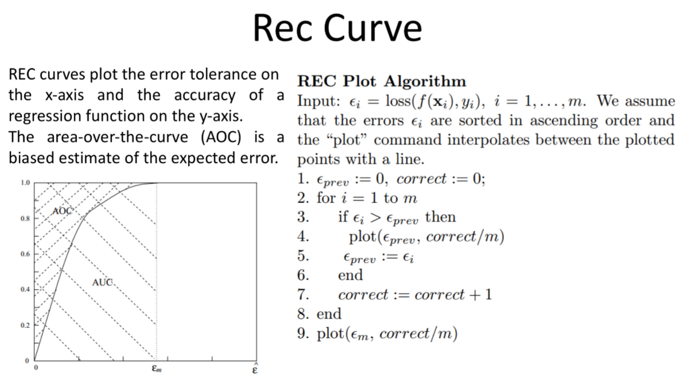
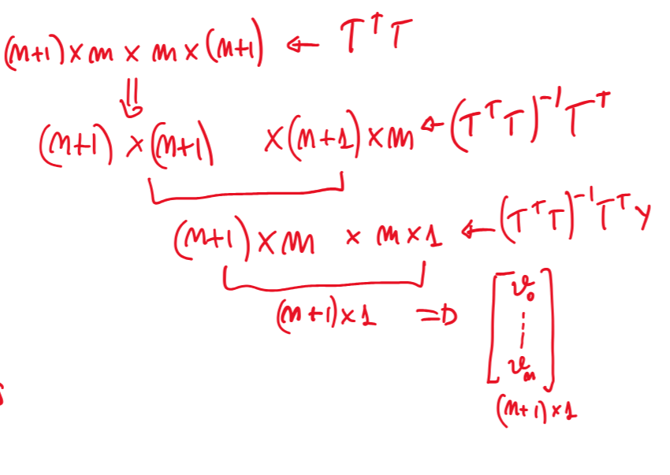
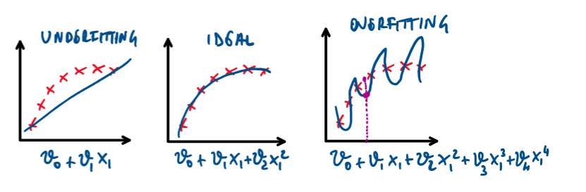

# Giovedì 27 marzo 2025

## Valutazione della Regressione Lineare

### MAE (Errore Assoluto Medio)

Questa metrica calcola l’errore assoluto medio tra le predizioni del modello e i valori osservati nei dati di test. Il MAE fornisce una misura dell’**errore medio tra le predizioni del modello e i valori reali**. È utile perché fornisce una stima diretta della **magnitudo degli errori** nel modello di regressione, indipendentemente dal segno degli errori. Un valore di MAE più basso indica una maggiore accuratezza del modello.

$$
\text{MAE} = \frac{1}{m} \sum_{i=1}^{m} \left| h_{\theta}(x^{(i)}) - y^{(i)} \right|
$$

---

### MSE (Errore Quadratico Medio)

Questa metrica calcola la media dei quadrati degli errori tra le predizioni del modello e i valori osservati. Il MSE **attribuisce un peso maggiore agli errori più grandi** rispetto al MAE, poiché eleva al quadrato ciascun errore. È utile perché penalizza maggiormente gli errori grandi, fornendo così una misura della **dispersione complessiva degli errori del modello**. Un valore di MSE più basso indica una maggiore accuratezza del modello.

$$
\text{MSE} = \frac{1}{m} \sum_{i=1}^{m} \left( h_{\theta}(x^{(i)}) - y^{(i)} \right)^2
$$

---

### RMSE (Radice dell'Errore Quadratico Medio)

Questa metrica è semplicemente la radice quadrata del MSE. L’RMSE fornisce una misura della **deviazione standard degli errori del modello** ed è espressa nella stessa unità della variabile target. È utile perché fornisce una stima della dispersione degli errori del modello in termini dell’unità della variabile dipendente. 
È una misura di quanto sono dispersi i residui.
Un valore di RMSE più basso indica un miglior adattamento del modello ai dati.

$$
\text{RMSE} = \sqrt{\text{MSE}}
$$

## Rec Curve

Le curve REC forniscono una valutazione delle prestazioni dei modelli di regressione ordinando gli errori di previsione dal più piccolo al più grande e creando dei raggruppamenti cumulativi basati su questi errori. Viene poi tracciata una curva sui raggruppamenti cumulativi degli errori fino a un certo livello, εₘ. Questo processo permette di contare il numero di esempi (pattern) che presentano un errore pari o inferiore a un determinato valore, fornendo così una somma cumulativa degli errori.

L'**area sotto la curva REC (AUC)** rappresenta una misura dell'efficacia dell'algoritmo. Se un modello produce molti errori piccoli, la curva crescerà rapidamente, indicando una maggiore accuratezza nelle previsioni. L'**area sopra la curva (AOC)** fornisce invece una misura dell'errore nelle previsioni.

Per confrontare due modelli, si possono sovrapporre le rispettive curve REC: in generale, il modello con l’area sotto la curva più ampia è considerato migliore, poiché indica una maggiore capacità predittiva e una minore incertezza nei risultati.

## Equazione Normale

Il metodo dell'equazione normale trova i parametri ottimali $\Theta$ in un singolo step, risolvendo analiticamente il problema. Siano:

$$
T = \begin{bmatrix}
x_0^{(1)} & x_1^{(1)} & \cdots & x_d^{(1)} \\
x_0^{(2)} & x_1^{(2)} & \cdots & x_d^{(2)} \\
\vdots & \vdots & \ddots & \vdots \\
x_0^{(m)} & x_1^{(m)} & \cdots & x_d^{(m)}
\end{bmatrix}, \quad
y = \begin{bmatrix}
y^{(1)} \\
y^{(2)} \\
\vdots \\
y^{(m)}
\end{bmatrix}
$$

Supponendo che $T^T T$ sia invertibile (altrimenti si utilizza la pseudo-inversa), allora si può dimostrare che:

$$
\hat{\Theta} = \arg\min_\Theta J(\Theta) = (T^T T)^{-1} T^T y
$$

## Comparazione dei metodi

| Gradiente Discendente | Equazione Normale |
|------------------|--------------------|
| Si deve selezionare il learning rate | Nessun learning rate da selezionare |
| Necessita di molte iterazioni | È un metodo diretto |
| Funziona bene anche per tante features | Rallenta molto all'aumentare delle features |
| Nessun calcolo particolarmente pesante | Deve computare un'inversa |
| Consigliato per $d > 1000$ | Consigliato per $d < 1000$ |

## Calcolo dell'equzione normale

## Overfitting e Underfitting

### ⚠️ **Overfitting**

* Il modello è **troppo complesso** rispetto alla quantità o alla natura dei dati.
* Esempio: usare un polinomio di grado 15 per interpolare solo 5 punti.
* **Effetti**:

  * Basso errore sul **training set**
  * Alto errore su **validation/test set**
  * Il modello “impara a memoria” i dati di addestramento, ma non sa generalizzare.
* **Cause comuni**:

  1. Numero di feature $\gg$ numero di esempi
  2. Modelli complessi (reti neurali profonde, polinomi di alto grado, ecc.)

---

### ⚠️ **Underfitting**

* Il modello è **troppo semplice** per catturare la struttura dei dati.
* Esempio: usare una retta per dati chiaramente curvilinei.
* **Effetti**:

  * Alto errore sia su **training** che su **validation/test**
  * Il modello non riesce a catturare nemmeno la tendenza generale.

---

### ✅ **Caso ideale (good fit)**

* Il modello ha una **complessità adeguata**: non troppo semplice, non troppo complesso.
* Cattura le **relazioni vere** nei dati, ma **non il rumore**.
* **Effetti**:

  * Basso errore su training set
  * Basso errore su validation/test set
  * Il modello generalizza bene

La soluzione al fine di evitare l'overfitting è la **Regolarizzazione**.

## Regolarizzazione

**Obiettivo:**
Evitare l’overfitting → si aggiunge un termine di regolarizzazione alla funzione costo.

Anche se il numero di features è alto, la regolarizzazione:

  * considera comunque tutti i parametri;
  * ma ne riduce il modulo (cioè li "schiaccia" verso zero).

  Ci sono due modi per misurare quanto sono grandi i parametri $\theta$:

  * Norma 1: $\|\theta\|_1 = \sum |\theta_j|$
  * Norma 2: $\|\theta\|_2 = \sqrt{\sum \theta_j^2}$

---

---

### 🧠 Esempio pratico:

Si prende una funzione costo con penalità sui coefficienti $\theta_3$ e $\theta_4$:

$$
J(\theta) = \frac{1}{2m} \sum (h_\theta(x^{(i)}) - y^{(i)})^2 + 1000 * \theta_3 + 1000 *\theta_4
$$

👉 Questo significa che più $\theta_3$ e $\theta_4$ sono grandi, più la funzione costo aumenta, anche se il modello si adatta bene ai dati.

---

### 💡 Conclusione:

L’unico modo per minimizzare questa funzione costo è fare in modo che:

$$
\theta_3 \approx 0 \quad \text{e} \quad \theta_4 \approx 0
$$

Risultato:

* I termini complessi come $\theta_3 x_1^3$, $\theta_4 x_1^4$ scompaiono,
* Il modello si semplifica automaticamente, evitando l’overfitting.

## Nuova funzione costo regolarizzata

Il goal: Mantenere i valori dei parametri piccoli e provare a semplificare l'ipotesi

$$
J(\Theta) = \frac{1}{2m} \left( \sum_{i=1}^{m} \left( h_\Theta(x^{(i)}) - y^{(i)} \right)^2 \right) + \lambda\sum_{j=1}^{n} \theta_j^2
$$

- La prima parte è la funzione costo classica (fit tra $h_\Theta(x)$ e $y$)
- La seconda parte è il termine di regolarizzazione
- $\lambda$: parametro di regolarizzazione
  - Controlla il trade-off tra errore e regolarizzazione
  - Più $\lambda$ è grande, più pesante sarà la regolarizzazione

> Nota: Se $\lambda$ è troppo grande, c'è il rischio di underfit (tutti i parametri $\approx 0$)

---

## Problema

Trovare il $\hat{\Theta}$ che minimizza la funzione costo regolarizzata $J(\Theta)$.

---

## Quale algoritmo di learning?

### Gradient Descent

L'aggiornamento del parametro $\theta_j$:

$$
\theta_j := \theta_j - \alpha \frac{\partial}{\partial \theta_j} J(\Theta)
$$

### Derivata della funzione costo regolarizzata:

Per $j = 0$ (bias term):

$$
\frac{\partial}{\partial \theta_0} J(\Theta) = \frac{1}{m} \sum_{i=1}^{m} \left( h_\Theta(x^{(i)}) - y^{(i)} \right) x_0^{(i)}
$$

Per $j \geq 1$:

$$
\frac{\partial}{\partial \theta_j} J(\Theta) = \frac{1}{m} \sum_{i=1}^{m} \left( h_\Theta(x^{(i)}) - y^{(i)} \right) x_j^{(i)} + \frac{\lambda}{m} \theta_j
$$

### Riscrittura dell’aggiornamento per $j \geq 1$:

$$
\theta_j := \theta_j \left(1 - \alpha \frac{\lambda}{m} \right) - \alpha \cdot \frac{1}{m} \sum_{i=1}^{m} \left( h_\Theta(x^{(i)}) - y^{(i)} \right) x_j^{(i)}
$$

> 📌 Questo aiuta a penalizzare parametri troppo grandi e a controllare l’overfitting.

