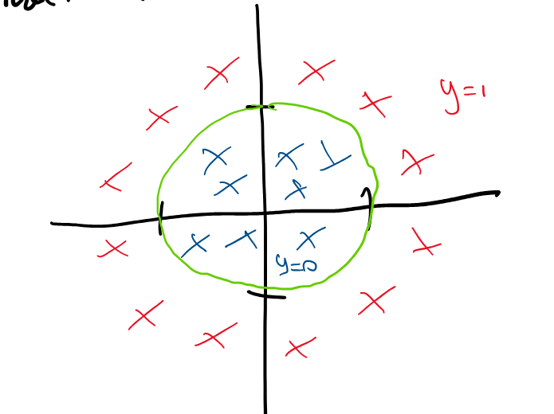
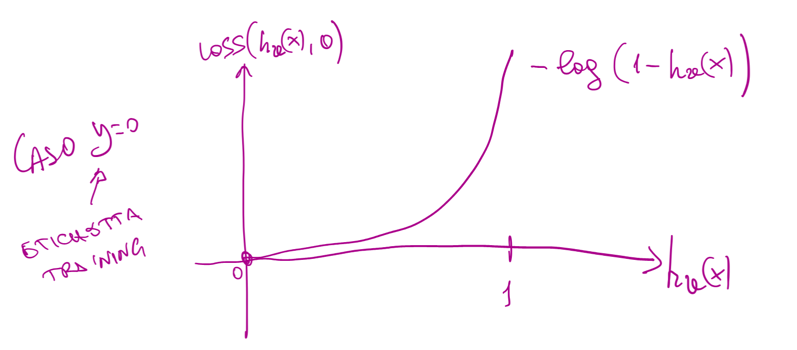
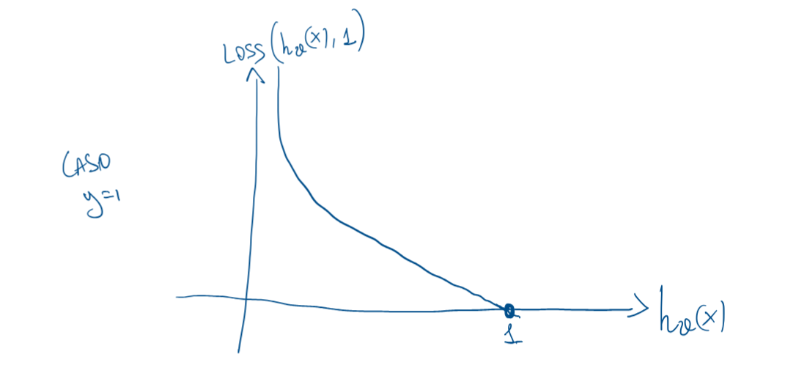
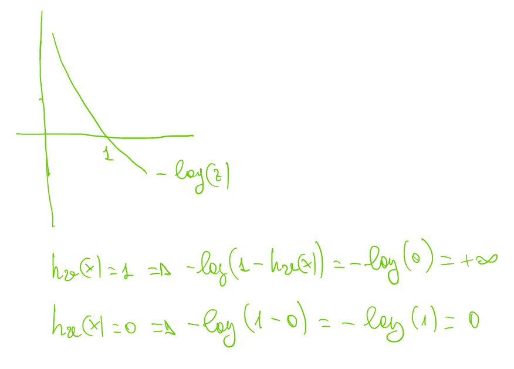
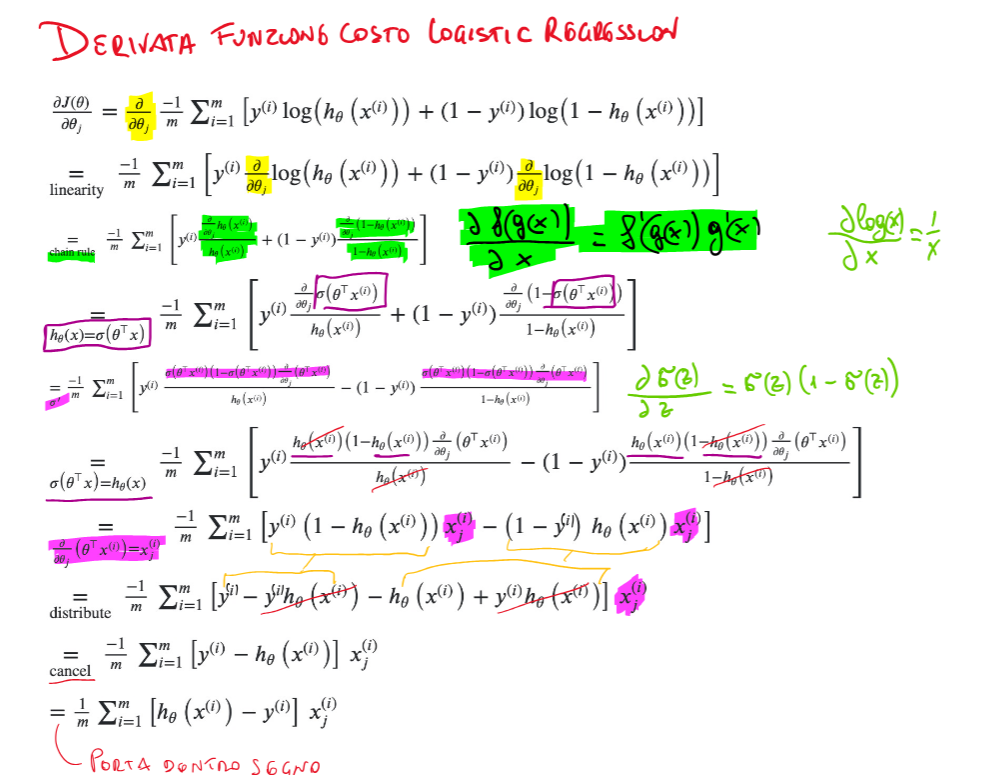

# Martedì 01 aprile 2025

## Classificazione

Obiettivo: Definire un modello parametrizzato, una funzione costo e un algoritmo di learning utili a trovare in automatico il decision boundary considerando il training set.

La costruzione del training set deve rispecchiare la popolazione delle classi.


## Classificazione Binaria e Multi Classe


Un modo per trattare problemi multi-classe è quello di suddividere il problema in tanti problemi binari. Si risolvono i vari problemi binari e si mettono insieme le soluzioni al fine di ottenere la soluzione del problema multiclasse.

Approcci:
- One VS One
- One VS All

### Esempi di classificazione binaria
- Riconoscimento di un tumore al seno (Y={1 se tumore, 0 altrimenti})
- Riconoscimento facciale (Y={1 se presente un volto, 0 altrimenti})
- Spam Detector (Y={1 email spam, 0 altrimenti})

## Possiamo usare il modello di regressione per la classificazione binaria?


### Idea errata

> Se `h(x) ≥ 0.5` allora assegno classe 1 (es. "caso positivo" o "tumore maligno")
> Altrimenti assegno classe 0 (es. "non tumore maligno")

### Problema:

Un modello di **regressione lineare** può assumere **valori arbitrari** (anche negativi o maggiori di 1), che **non hanno significato probabilistico** per la classificazione.

### Esempio grafico:


###  A quale classe assegnare un nuovo punto?

* Se `h(x) > 0.5`, lo assegno a **classe positiva**
* Se `h(x) ≤ 0.5`, lo assegno a **classe negativa**
* Tuttavia, questa soglia può essere **arbitraria o inefficace**.

### Cosa accade se i dati sono molto sbilanciati?

* Aggiungendo **un solo campione sbilanciato**, la retta può spostarsi molto.
* Il modello diventa **molto sensibile** ai dati di training.
* La retta **non generalizza bene**.


### ⚠️ Problema principale

Il modello `h(x) = θᵗx` usato per regressione **non è vincolato** tra 0 e 1.

### Soluzione: **Logistic Regression**

Si usa la **sigmoid**:

```math
0 ≤ hθ(x) ≤ 1
```

* Questo garantisce che il modello produca **valori interpretabili come probabilità**.
* È quindi adatto per **problemi di classificazione**.


### ✅ Conclusione

* Un **modello di regressione lineare** **non deve essere usato** per risolvere problemi di classificazione.
* Un **modello di regressione**, opportunamente adattato (es. **regressione logistica**), **può essere utile** per problemi di classificazione.


## Regressione Logistica


###  Funzione Sigmoide (Logistic Function)

La funzione sigmoide è definita come:

```math
\sigma(z) = \frac{1}{1 + e^{-z}}
```

Questa funzione:

* Ha un range limitato tra 0 e 1
* È **non lineare**
* Ha un'interpretazione **probabilistica**
* È utilizzata per "mappare" valori reali in probabilità

### 📈 Grafico della sigmoide

* Quando $z = 0$, $\sigma(z) = 0.5$
* Limite inferiore: $\sigma(z) \to 0$ per $z \to -\infty$
* Limite superiore: $\sigma(z) \to 1$ per $z \to +\infty$


---

## ✅ Modello di Regressione Logistica

Il modello è definito come:

```math
h_\theta(x) = \sigma(\theta^T x) = \frac{1}{1 + e^{-\theta^T x}}
```

Dove:

* $\theta$ è il **vettore dei parametri**
* $x$ è il **vettore delle feature** dell’input

---

## 📐 Proprietà della funzione sigmoide $\sigma(z)$

* **Simmetria**:

  ```math
  1 - \sigma(z) = \sigma(-z)
  ```

* **Derivata della sigmoide**:

  ```math
  \frac{d}{dz} \sigma(z) = \sigma(z)(1 - \sigma(z)) = \sigma(z)\sigma(-z)
  ```

* **Forma alternativa** (in termini della funzione tangente iperbolica):

  ```math
  \sigma(z) = \frac{1}{2} + \frac{1}{2} \tanh\left(\frac{z}{2}\right)
  ```

## 📌 Interpretazione probabilistica

Il modello logistico può essere interpretato come:

```math
h_\theta(x) = P(y = 1 \mid x, \theta)
```

Dunque:

```math
P(y = 1 \mid x, \theta) + P(y = 0 \mid x, \theta)  = 1
```

```math
P(y = 0 \mid x; \theta) = 1 - P(y = 1 \mid x, \theta) = 1 - h_\theta(x) = h_\theta(-x) = \frac{1}{1 + e^{\theta^T x}}
```

---

## 🧠 Osservazione sul modello logistico 

### 🔍 Analisi del grafico della funzione sigmoide


La funzione sigmoide $\sigma(z) = \frac{1}{1 + e^{-z}}$ ha una proprietà fondamentale:

* Quando $z = 0$, $\sigma(z) = 0.5$ (massima incertezza)
* Quando $z > 0$, $\sigma(z) > 0.5$
* Quando $z < 0$, $\sigma(z) < 0.5$

---

## 🎯 Cosa significa questo?

### Se definiamo:

```math
h_\theta(x) = \sigma(\theta^T x)
```

Allora:

* Se $\theta^T x \geq 0$ → $h_\theta(x) \geq 0.5$ → classe **1**
* Se $\theta^T x < 0$ → $h_\theta(x) < 0.5$ → classe **0**

Questo implica che la **decisione di classificazione binaria** può essere fatta osservando direttamente il **segno** di $\theta^T x$, **senza calcolare la sigmoide**.

> **💡 Osservazione pratica**: durante la fase di **predizione**, possiamo semplificare la classificazione così:
>
> ```math
> \text{Classe predetta} = \begin{cases}
> 1 & \text{se } \theta^T x \geq 0 \\
> 0 & \text{altrimenti}
> \end{cases}
> ```

## Esempio

Supponiamo di voler classificare punti nel piano $\mathbb{R}^2$ (cioè coppie $(x_1, x_2)$) in due classi:

* Classe **0**: rappresentata da cerchi (`o`)
* Classe **1**: rappresentata da croci (`x`)


## 🧠 Il modello logistico

Il modello di regressione logistica ha la forma:

$$
\sigma(\theta^T x) = \frac{1}{1 + e^{-\theta^T x}}
$$

Dove:

* $\sigma$ è la funzione sigmoide
* $\theta \in \mathbb{R}^3$ è il vettore dei parametri
* $x \in \mathbb{R}^3$ è il vettore degli input (incluso $x_0 = 1$ per il bias)

### In questo esempio:

$$
\theta = \begin{bmatrix} -3 \\ 1 \\ 1 \end{bmatrix}
$$

quindi la funzione logistica diventa:

$$
\sigma(\theta^T x) = \frac{1}{1 + e^{-(-3 + x_1 + x_2)}}
$$

---

## 🔷 Decision Boundary

La **decision boundary** è definita dal punto in cui il modello è incerto, cioè:

$$
\sigma(\theta^T x) = 0.5 \quad \Rightarrow \quad \theta^T x = 0
$$

Sostituendo i valori:

$$
-3 + x_1 + x_2 = 0 \quad \Rightarrow \quad x_1 + x_2 = 3
$$

Questa è l'equazione della retta che separa le due classi nel piano.

### Punti che soddisfano la boundary:

* $(x_1, x_2) = (0, 3)$
* $(x_1, x_2) = (3, 0)$

---

## ✅ Regola di classificazione

### Per la classe 1:

$$
\hat{y} = 1 \quad \Leftrightarrow \quad \theta^T x \geq 0 \quad \Leftrightarrow \quad x_1 + x_2 \geq 3
$$

### Per la classe 0:

$$
\hat{y} = 0 \quad \Leftrightarrow \quad \theta^T x < 0 \quad \Leftrightarrow \quad x_1 + x_2 < 3
$$

---

## Regressione Logistica non lineare
$$
\sigma(\theta^T x) = \theta_0 + \theta_1x_1 + \theta_2x_2 + \theta_3x_1^2 + \theta_4x_2^2
$$


$$
\theta = \begin{bmatrix} -1 \\ 0 \\ 0 \\ 1 \\ 1 \end{bmatrix}
$$

Il decision boundary è uguale a: $x_1^2+x_2^2=1$

Gli elementi verranno classificati come:

- Classe 1 se  $x_1^2+x_2^2\geq1$
- Classe 0 se  $x_1^2+x_2^2<1$



Trasformando le feature con un mapping non lineare (es polinomiale) possiamo risolvere problemi di classificazione binaria non separabili da una semplice linea (oppure iperpiani nel caso di d>2)

## Come facciamo a scegliere i parametri $\theta$?


Nel contesto della **classificazione binaria**, il nostro obiettivo è addestrare un modello affinché predica correttamente una variabile target $y \in \{0, 1\}$ a partire da un input $x$. L’output del nostro modello è una probabilità stimata $h_\theta(x) = \hat{y} \in (0, 1)$, ottenuta tipicamente applicando la **sigmoid** all’output lineare.

Per valutare quanto il modello sia distante dalla verità, utilizziamo una **funzione di costo** detta **loss function**. Una delle più efficaci per la classificazione binaria è la **cross-entropy**, definita come:

$$
J(\theta) = \frac{1}{m} \sum_{i=1}^{m} \text{Loss}(h_\theta(x^{(i)}), y^{(i)})
$$

Dove la **loss per singolo esempio** è definita così:

$$
\text{Loss}(h_\theta(x), y) =
\begin{cases}
- \log(h_\theta(x)) & \text{se } y = 1 \\
- \log(1 - h_\theta(x)) & \text{se } y = 0
\end{cases}
$$

Questa scelta è particolarmente potente per vari motivi. Anzitutto, si basa su funzioni **logaritmiche**, che presentano delle proprietà molto interessanti: sono **derivabili**, **continue** e — cosa più importante — hanno una crescita **molto rapida** all’avvicinarsi a zero. Questo significa che **errori gravi** (cioè assegnare bassa probabilità alla classe corretta) vengono penalizzati in modo molto severo, mentre le predizioni corrette vengono premiate con una loss molto piccola o nulla.





Per esempio:

* Se $y = 1$ e $h_\theta(x) \to 1$, allora $-\log(h_\theta(x)) \to 0$ (quindi perdita quasi nulla).
* Se invece $h_\theta(x) \to 0$, la perdita $-\log(h_\theta(x)) \to +\infty$.

Allo stesso modo, quando $y = 0$, la loss diventa $-\log(1 - h_\theta(x))$:

* Se $h_\theta(x) \to 0$, allora la loss tende a 0 (ottimo).
* Se $h_\theta(x) \to 1$, la loss esplode a $+\infty$.



Questa dinamica permette un **apprendimento efficace**, poiché guida l’algoritmo di ottimizzazione (es. discesa del gradiente) nella giusta direzione, rendendolo **reattivo** soprattutto quando il modello commette errori evidenti.

Per semplificare la scrittura della loss in un’unica formula, si può riscrivere come:

$$
\text{Loss}(h_\theta(x), y) = - y \log(h_\theta(x)) - (1 - y) \log(1 - h_\theta(x))
$$

Questa forma compatta è molto utile perché unifica i due casi $y = 0$ e $y = 1$ in una sola espressione matematica.

La **funzione complessiva di costo** per il modello su tutto il dataset diventa quindi:

$$
J(\theta) = - \frac{1}{m} \sum_{i=1}^{m} \left[ y^{(i)} \log(h_\theta(x^{(i)})) + (1 - y^{(i)}) \log(1 - h_\theta(x^{(i)})) \right]
$$

Questa funzione è nota come **funzione di cross-entropy**, ed è **convessa** quando è combinata con la sigmoid. La **convessità** è fondamentale: essa garantisce che esista un solo minimo globale e rende molto più efficiente la discesa del gradiente.

È importante notare che, al contrario, l’utilizzo della **Mean Squared Error (MSE)** in combinazione con la sigmoid porta a problemi: la funzione di costo **non è convessa**, la derivata della sigmoid tende a essere molto piccola lontano dallo zero, e questo causa una **discesa del gradiente molto lenta**.

---

### ✅ **Conclusione**

La **cross-entropy loss** è una scelta ideale per la classificazione binaria perché:

* È **sensibile agli errori**;
* È **derivabile** e **convessa**;
* Favorisce un **apprendimento più rapido e stabile** rispetto ad altre funzioni di costo come la MSE;
* Integra perfettamente il comportamento della sigmoid, penalizzando le false certezze (cioè assegnare alta probabilità alla classe sbagliata).

In definitiva, questa loss non solo misura l’errore, ma **guida l’apprendimento in modo intelligente**.

## Quale algoritmo usiamo? La Discesa del Gradiente

Serve la derivata della funzione costo della Cross Entropy:




## 📉 **Funzione di Costo per la Classificazione Logistica**

### Funzione di costo (Cross-Entropy):

$$
J(\vec{v}) = \frac{1}{m} \sum_{i=1}^{m} \text{Loss}(h_{\vec{v}}(x^{(i)}), y^{(i)}) =
- \frac{1}{m} \left[ \sum_{i=1}^{m} y^{(i)} \log(h_{\vec{v}}(x^{(i)})) + (1 - y^{(i)}) \log(1 - h_{\vec{v}}(x^{(i)})) \right]
$$

---

## 🔁 Derivata della funzione di costo rispetto a $\vec{v}_j$

$$
\frac{\partial J(\vec{v})}{\partial v_j} =
\frac{1}{m} \sum_{i=1}^{m} \left( h_{\vec{v}}(x^{(i)}) - y^{(i)} \right) x_j^{(i)}
\quad \forall j = 0, \ldots, d
$$

---

## ⚠️ **Osservazione importante**

> Attenzione:
> $h_{\vec{v}}(x^{(i)})$ **nasconde** la funzione **sigmoid**:

$$
h_{\vec{v}}(x^{(i)}) = \sigma(\vec{v}^\top x^{(i)})
$$

> Sebbene la forma della derivata sia identica a quella vista per la **regressione lineare**, qui è applicata alla **classificazione logistica** grazie alla sigmoid.

Certo! Ecco un discorso che riassume e collega i concetti espressi nelle due immagini, adatto per una presentazione, una lezione o uno studio guidato:

---

## Funzione di Costo ed Entropia nella Classificazione


### 🧠 1. Funzione di Costo: Cross-Entropy Loss

Partiamo dalla funzione di costo, che è l'obiettivo da minimizzare durante l'addestramento del modello.
Nel caso della regressione logistica o di una rete neurale con uscita sigmoidale, la funzione di costo usata è:

$$
J(\theta) = -\frac{1}{m} \sum_{i=1}^{m} \left[ y^{(i)} \log(h_\theta(x^{(i)})) + (1 - y^{(i)}) \log(1 - h_\theta(x^{(i)})) \right]
$$

Questa è la cross-entropy loss, ed è costruita in modo da penalizzare fortemente le previsioni sbagliate con alta confidenza.
Ad esempio, se il vero valore è 1 ma il modello predice una probabilità bassa, la perdita è alta perché $\log(h_\theta(x))$ sarà molto negativo.

---

### 🔍 2. Entropia: Misura dell’Incertezza

L'entropia, in termini informatici, misura l’incertezza di una distribuzione. È definita come:

$$
H(X) = -\sum_{k=1}^{K} p_k \log(p_k)
$$

Se la probabilità è concentrata su una sola classe (es. $p = 1$ e gli altri 0), l'entropia è minima: nessuna incertezza.
Se invece le probabilità sono distribuite equamente (es. $p = 0.5, 0.5$), l'entropia è massima: massima incertezza.

Questo concetto è utile per capire quanto "confusa" o "decisa" sia una previsione.

---

### 🔁 3. Cross-Entropy come Distanza tra Distribuzioni

La cross-entropy misura quanto una distribuzione stimata $q$ si discosta da una distribuzione vera $p$.
Nel contesto del machine learning:

* $p$ è l’etichetta vera (ground truth), rappresentata come una distribuzione con 1 nella classe corretta.
* $q$ è la distribuzione stimata dal classificatore (es. softmax o sigmoid).

La formula è:

$$
H(p, q) = -\sum_{k} p_k \log(q_k)
$$

Dato che $p_k$ è 1 solo per la classe corretta, la loss si riduce a:

$$
-\log(q_{\text{corretto}})
$$

In altre parole, stiamo penalizzando il modello quando assegna bassa probabilità alla classe corretta.

---

### 📊 4. Analisi dei Casi

Vediamo due situazioni:

* Quando la vera etichetta è 0: la loss è $-\log(1 - h_\theta(x))$
* Quando la vera etichetta è 1: la loss è $-\log(h_\theta(x))$

In entrambi i casi, più la previsione è lontana dalla verità, più alta è la perdita.

Questo spiega perché la cross-entropy è una misura efficace per classificazione: non solo penalizza gli errori, ma penalizza anche la sicurezza sbagliata.

### 📌 Conclusione

La cross-entropy unisce il concetto matematico di entropia all’obiettivo pratico del machine learning: fare previsioni corrette e sicure.
Minimizzare la cross-entropy equivale a massimizzare la correttezza e la sicurezza del nostro modello.

Capire questi concetti non solo aiuta a costruire modelli migliori, ma anche a interpretarne il comportamento e le metriche in modo più consapevole.