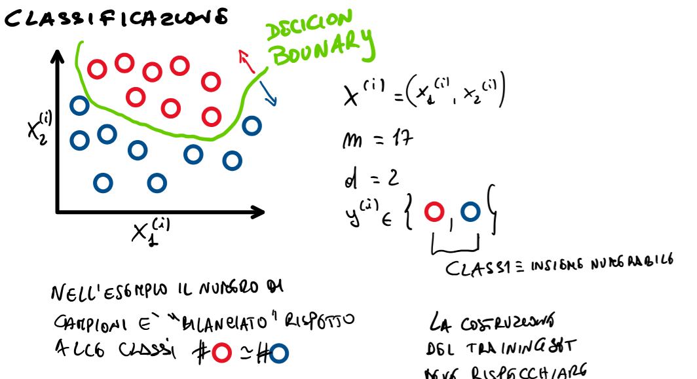
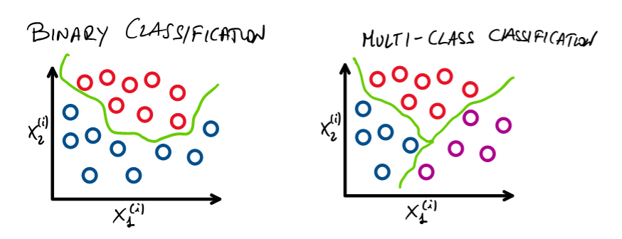
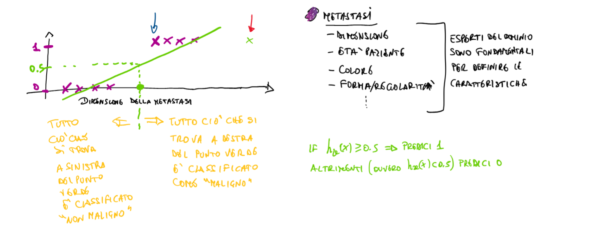
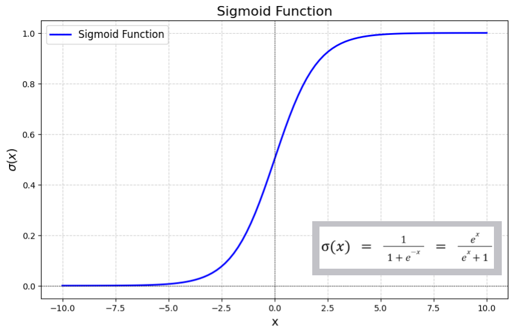
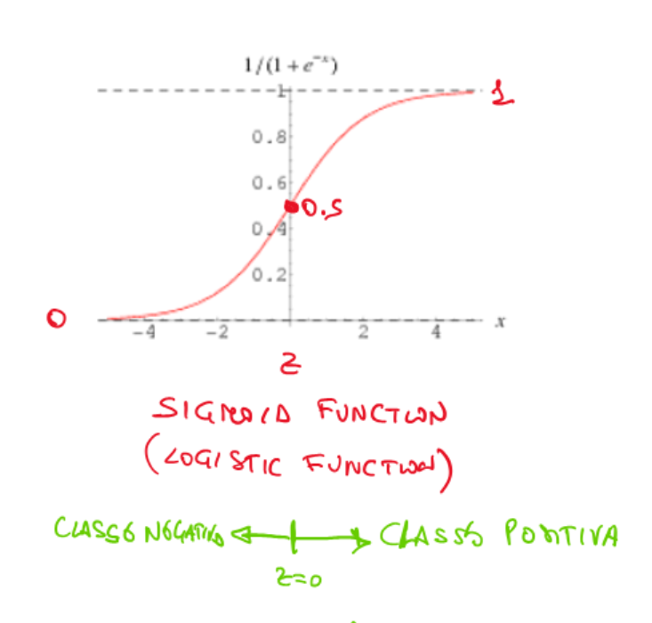
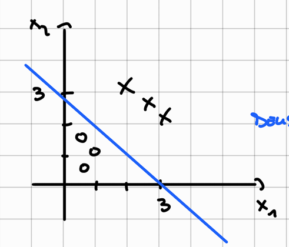

# Martedì 01 aprile 2025

## Classificazione

Obiettivo: Definire un modello parametrizzato, una funzione costo e un algoritmo di learning utili a trovare in automatico il decision boundary considerando il training set.

La costruzione del training set deve rispecchiare la popolazione delle classi.



## Classificazione Binaria e Multi Classe




Un modo per trattare problemi multi-classe è quello di suddividere il problema in tanti problemi binari. Si risolvono i vari problemi binari e si mettono insieme le soluzioni al fine di ottenere la soluzione del problema multiclasse.

Approcci:
- One VS One
- One VS All

### Esempi di classificazione binaria
- Riconoscimento di un tumore al seno (Y={1 se tumore, 0 altrimenti})
- Riconoscimento facciale (Y={1 se presente un volto, 0 altrimenti})
- Spam Detector (Y={1 email spam, 0 altrimenti})

## Possiamo usare il modello di regressione per la classificazione binaria?


### Idea errata

> Se `h(x) ≥ 0.5` allora assegno classe 1 (es. "caso positivo" o "tumore maligno")
> Altrimenti assegno classe 0 (es. "non tumore maligno")

### Problema:

Un modello di **regressione lineare** può assumere **valori arbitrari** (anche negativi o maggiori di 1), che **non hanno significato probabilistico** per la classificazione.

### Esempio grafico:




###  A quale classe assegnare un nuovo punto?

* Se `h(x) > 0.5`, lo assegno a **classe positiva**
* Se `h(x) ≤ 0.5`, lo assegno a **classe negativa**
* Tuttavia, questa soglia può essere **arbitraria o inefficace**.

### Cosa accade se i dati sono molto sbilanciati?

* Aggiungendo **un solo campione sbilanciato**, la retta può spostarsi molto.
* Il modello diventa **molto sensibile** ai dati di training.
* La retta **non generalizza bene**.


### ⚠️ Problema principale

Il modello `h(x) = θᵗx` usato per regressione **non è vincolato** tra 0 e 1.

### Soluzione: **Logistic Regression**

Si usa la **sigmoid**:

```math
0 ≤ hθ(x) ≤ 1
```

* Questo garantisce che il modello produca **valori interpretabili come probabilità**.
* È quindi adatto per **problemi di classificazione**.


### ✅ Conclusione

* Un **modello di regressione lineare** **non deve essere usato** per risolvere problemi di classificazione.
* Un **modello di regressione**, opportunamente adattato (es. **regressione logistica**), **può essere utile** per problemi di classificazione.


## Regressione Logistica


###  Funzione Sigmoide (Logistic Function)

La funzione sigmoide è definita come:

```math
\sigma(z) = \frac{1}{1 + e^{-z}}
```

Questa funzione:

* Ha un range limitato tra 0 e 1
* È **non lineare**
* Ha un'interpretazione **probabilistica**
* È utilizzata per "mappare" valori reali in probabilità

### 📈 Grafico della sigmoide

* Quando $z = 0$, $\sigma(z) = 0.5$
* Limite inferiore: $\sigma(z) \to 0$ per $z \to -\infty$
* Limite superiore: $\sigma(z) \to 1$ per $z \to +\infty$




---

## ✅ Modello di Regressione Logistica

Il modello è definito come:

```math
h_\theta(x) = \sigma(\theta^T x) = \frac{1}{1 + e^{-\theta^T x}}
```

Dove:

* $\theta$ è il **vettore dei parametri**
* $x$ è il **vettore delle feature** dell’input

---

## 📐 Proprietà della funzione sigmoide $\sigma(z)$

* **Simmetria**:

  ```math
  1 - \sigma(z) = \sigma(-z)
  ```

* **Derivata della sigmoide**:

  ```math
  \frac{d}{dz} \sigma(z) = \sigma(z)(1 - \sigma(z)) = \sigma(z)\sigma(-z)
  ```

* **Forma alternativa** (in termini della funzione tangente iperbolica):

  ```math
  \sigma(z) = \frac{1}{2} + \frac{1}{2} \tanh\left(\frac{z}{2}\right)
  ```

## 📌 Interpretazione probabilistica

Il modello logistico può essere interpretato come:

```math
h_\theta(x) = P(y = 1 \mid x, \theta)
```

Dunque:

```math
P(y = 1 \mid x, \theta) + P(y = 0 \mid x, \theta)  = 1
```

```math
P(y = 0 \mid x; \theta) = 1 - P(y = 1 \mid x, \theta) = 1 - h_\theta(x) = h_\theta(-x) = \frac{1}{1 + e^{\theta^T x}}
```

---

## 🧠 Osservazione sul modello logistico 

### 🔍 Analisi del grafico della funzione sigmoide




La funzione sigmoide $\sigma(z) = \frac{1}{1 + e^{-z}}$ ha una proprietà fondamentale:

* Quando $z = 0$, $\sigma(z) = 0.5$ (massima incertezza)
* Quando $z > 0$, $\sigma(z) > 0.5$
* Quando $z < 0$, $\sigma(z) < 0.5$

---

## 🎯 Cosa significa questo?

### Se definiamo:

```math
h_\theta(x) = \sigma(\theta^T x)
```

Allora:

* Se $\theta^T x \geq 0$ → $h_\theta(x) \geq 0.5$ → classe **1**
* Se $\theta^T x < 0$ → $h_\theta(x) < 0.5$ → classe **0**

Questo implica che la **decisione di classificazione binaria** può essere fatta osservando direttamente il **segno** di $\theta^T x$, **senza calcolare la sigmoide**.

> **💡 Osservazione pratica**: durante la fase di **predizione**, possiamo semplificare la classificazione così:
>
> ```math
> \text{Classe predetta} = \begin{cases}
> 1 & \text{se } \theta^T x \geq 0 \\
> 0 & \text{altrimenti}
> \end{cases}
> ```

## Esempio

Supponiamo di voler classificare punti nel piano $\mathbb{R}^2$ (cioè coppie $(x_1, x_2)$) in due classi:

* Classe **0**: rappresentata da cerchi (`o`)
* Classe **1**: rappresentata da croci (`x`)




## 🧠 Il modello logistico

Il modello di regressione logistica ha la forma:

$$
\sigma(\theta^T x) = \frac{1}{1 + e^{-\theta^T x}}
$$

Dove:

* $\sigma$ è la funzione sigmoide
* $\theta \in \mathbb{R}^3$ è il vettore dei parametri
* $x \in \mathbb{R}^3$ è il vettore degli input (incluso $x_0 = 1$ per il bias)

### In questo esempio:

$$
\theta = \begin{bmatrix} -3 \\ 1 \\ 1 \end{bmatrix}
$$

quindi la funzione logistica diventa:

$$
\sigma(\theta^T x) = \frac{1}{1 + e^{-(-3 + x_1 + x_2)}}
$$

---

## 🔷 Decision Boundary

La **decision boundary** è definita dal punto in cui il modello è incerto, cioè:

$$
\sigma(\theta^T x) = 0.5 \quad \Rightarrow \quad \theta^T x = 0
$$

Sostituendo i valori:

$$
-3 + x_1 + x_2 = 0 \quad \Rightarrow \quad x_1 + x_2 = 3
$$

Questa è l'equazione della retta che separa le due classi nel piano.

### Punti che soddisfano la boundary:

* $(x_1, x_2) = (0, 3)$
* $(x_1, x_2) = (3, 0)$

---

## ✅ Regola di classificazione

### Per la classe 1:

$$
\hat{y} = 1 \quad \Leftrightarrow \quad \theta^T x \geq 0 \quad \Leftrightarrow \quad x_1 + x_2 \geq 3
$$

### Per la classe 0:

$$
\hat{y} = 0 \quad \Leftrightarrow \quad \theta^T x < 0 \quad \Leftrightarrow \quad x_1 + x_2 < 3
$$

---