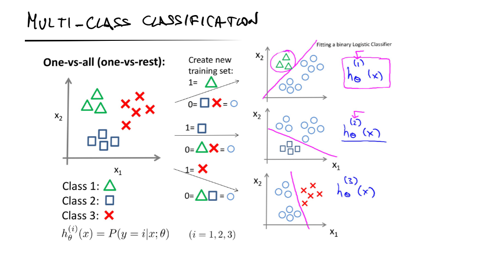
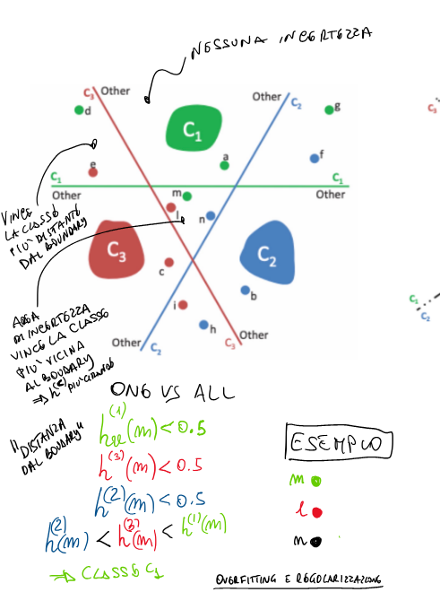
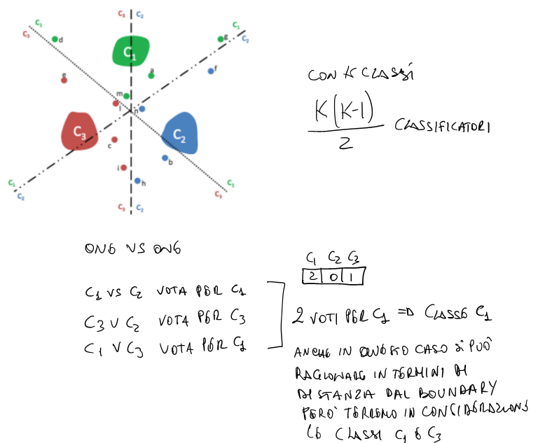
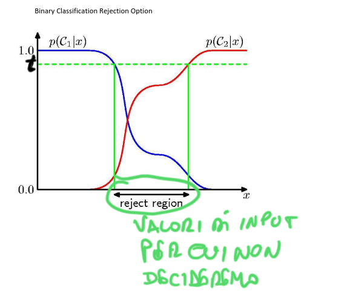
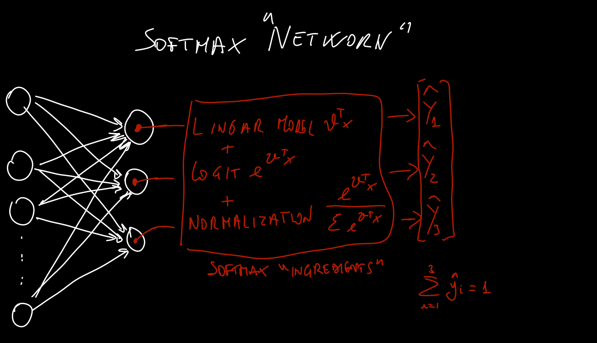
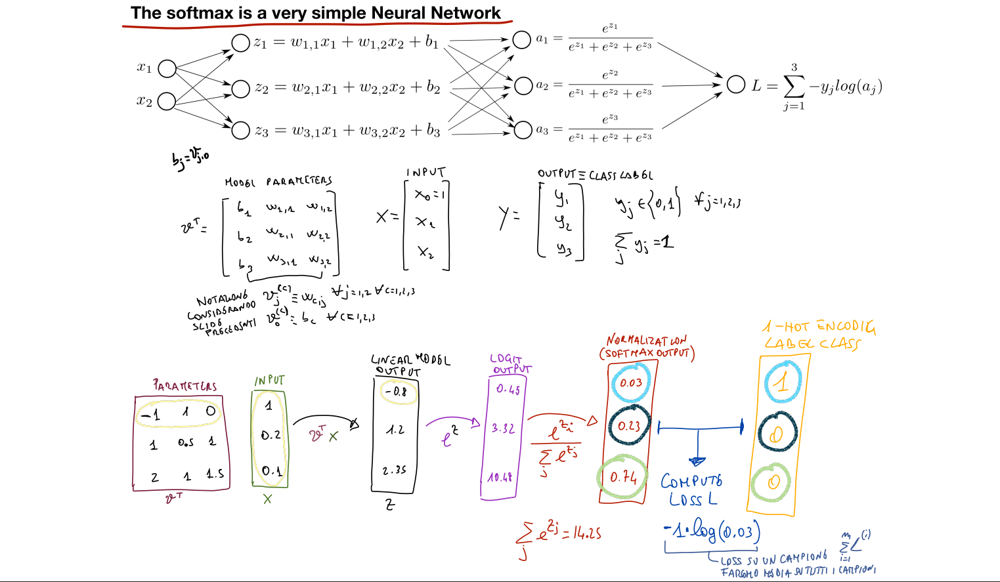

# Venerdì 11 aprile 2025

## Multi-Class Classification

* Stai considerando un caso in cui un classificatore deve distinguere tra più di 2 classi (es. Class 1, Class 2, Class 3).
* Viene mostrato un esempio 2D con tre tipi di punti (triangoli, cerchi e quadrati), ciascuno appartenente a una classe diversa.

---

## 📊 Probabilità e Decisione

Nella strategia One VS All si fa il training del classificatore binario per ogni classe k al fine di predire la probabilità.
### Formula:

$$
P(\omega_k | x)
$$

* È la **probabilità a posteriori** della classe $\omega_k$ dato il punto $x$.

### Decision Rule (regola di decisione):

$$
R = \text{max}_{k} \, P(\omega_k | x)
$$

* Il punto $x$ viene assegnato alla **classe con probabilità a posteriori massima**.
* Questo è un approccio **Bayesiano** alla classificazione.

---

## 📌 Esempio

$$
\begin{align*}
h_1(x) &= 0.3 \\
h_2(x) &= 0.8 \\
h_3(x) &= 0.1
\end{align*}
\Rightarrow \text{Classificato in } \textbf{Classe 2}
$$

* Gli output $h_k(x)$ sono le uscite dei classificatori.
* Anche se nessuna probabilità supera 0.5, si sceglie quella **con valore massimo**.

$$
\begin{align*}
h_1(x) &= 0.4 \\
h_2(x) &= 0.2 \\
h_3(x) &= 0.1
\end{align*}
\Rightarrow \text{Classificato in } \textbf{Classe 1}
$$
📌 Nota:

$$
\sum_k h_k(x) \quad \text{può assumere valori > 1}
$$

* Perché i classificatori non formano una distribuzione di probabilità.

## 🔀 One-vs-All

Ogni classificatore distingue tra:

* **una classe** vs **tutte le altre**.

Esempio:

* $h_1(m) < 0.5$
* $h_2(m) < 0.5$
* $h_3(m) < 0.5$

Regola:
Se $h_2(m) < h_3(m) < h_1(m) \rightarrow$  Classe 1

---

## 🤼‍♂️ One-vs-One

* Si addestrano classificatori per ogni **coppia di classi**:

  $$
  \text{Numero di classificatori} = \frac{K(K-1)}{2}
  $$

  dove $K$ è il numero di classi.

* Ogni classificatore decide tra due classi. Alla fine si vota la classe con più vittorie (sistema di voto a maggioranza).

📌 Esempio:
Classi $C_1, C_2, C_3$

* $C_1$ vs $C_2$ → vince $C_1$
* $C_2$ vs $C_3$ → vince $C_3$
* $C_1$ vs $C_3$ → vince $C_1$

Risultato: **Classe $C_1$**

📍 Nota: i **confini di decisione** sono più precisi in questo schema, ma più costosi da calcolare.

---

## 📉 Decisione binaria

Mostra la curva di probabilità per due classi $C_1$ e $C_2$:

* Dove si incrociano (linea tratteggiata verde) si trova la **decision boundary**.
* Zona in mezzo: **reject region** → valori in cui non è possibile decidere con sicurezza.

👉 Questo suggerisce che a volte, se nessuna classe ha abbastanza confidenza, si può decidere di **non classificare**.

## Regressione Logistica - Riepilogo

Framework di Apprendimento per Distinguere tra Due Classi

## Dati:
- $x^{(i)} \in \mathbb{R}^m$
- $y^{(i)} \in \{0, 1\}$
- $x_0^{(i)} = 1$

## Modello:
- $h_\mathbf{\theta}(x) = \frac{1}{1 + e^{-\mathbf{\theta}^T x}}$

## Parametri:
- $\mathbf{\theta}^T = [\theta_0, \theta_1, \theta_2, \ldots, \theta_m] \in \mathbb{R}^{m+1}$
- $x = \begin{bmatrix} 1 \\ x_1 \\ \vdots \\ x_m \end{bmatrix}$

## Obiettivo:
Minimizzare la funzione di costo $J(\mathbf{\theta})$:

$$
J(\mathbf{\theta}) = -\frac{1}{m} \left[ \sum_{i=1}^{m} y^{(i)} \log(h_\mathbf{\theta}(x^{(i)})) + (1 - y^{(i)}) \log(1 - h_\mathbf{\theta}(x^{(i)})) \right]
$$

➡️ **Perdita di entropia incrociata (cross-entropy loss)**

---

## Il metodo del gradiente discendente viene utilizzato per trovare i parametri $\mathbf{\theta}$

Aggiornamento iterativo:

$$
\theta_j := \theta_j - \alpha \frac{\partial J(\mathbf{\theta})}{\partial \theta_j}
\quad \text{per tutti i } j \text{ simultaneamente}
$$

- **Tasso di apprendimento** $\alpha$: 0.1, 0.03, 0.01, 0.003, 0.001, …

---

## Per prevenire l'overfitting si usa la regolarizzazione:

$$
J(\mathbf{\theta}) = -\frac{1}{m} \left[ \cdots \right] + \frac{\lambda}{2m} \sum_{j=1}^{m} \theta_j^2
$$

# Softmax

 
Framework di Apprendimento per la Classificazione Multi-Classe

È un'estensione della regressione logistica.

## Dati:
- $x^{(i)} \in \mathbb{R}^m$
- $x_0^{(i)} = 1$
- $y^{(i)} \in \{0, 1, \ldots, K - 1\}$

- $K$ classi  
  → **One-hot encoding**

## Insieme di addestramento:
$$
\{(x^{(1)}, y^{(1)}), (x^{(2)}, y^{(2)}), \ldots, (x^{(m)}, y^{(m)})\}
\quad \text{con } m \text{ campioni}
$$

## Obiettivo:
Stimare:
$$
P_\mathbf{\theta}^{(k)}(y = k \mid x) \quad \text{per ogni } k = 0, 1, \ldots, K - 1
$$

➡️ Il nostro modello deve stimare $K$ vettori

---

## Modello Softmax:

$$
h_\mathbf{\theta}(x) = 
\begin{bmatrix}
P_\mathbf{\theta}^{(0)}(y = 0 \mid x) \\
P_\mathbf{\theta}^{(1)}(y = 1 \mid x) \\
P_\mathbf{\theta}^{(2)}(y = 2 \mid x) \\
\vdots \\
P_\mathbf{\theta}^{(K-1)}(y = K - 1 \mid x)
\end{bmatrix}
=
\frac{1}{\sum_{k=0}^{K-1} e^{\mathbf{\theta}^{(k)T} x}}
\begin{bmatrix}
e^{\mathbf{\theta}^{(0)T} x} \\
e^{\mathbf{\theta}^{(1)T} x} \\
e^{\mathbf{\theta}^{(2)T} x} \\
\vdots \\
e^{\mathbf{\theta}^{(K-1)T} x}
\end{bmatrix}
$$

➡️ **Normalizza la distribuzione**

---

## Parametri:

$$
\mathbf{\theta} =
\begin{bmatrix}
\theta_0^{(0)} & \theta_0^{(1)} & \cdots & \theta_0^{(K-1)} \\
\theta_1^{(0)} & \theta_1^{(1)} & \cdots & \theta_1^{(K-1)} \\
\vdots    & \vdots    &        & \vdots \\
\theta_m^{(0)} & \theta_m^{(1)} & \cdots & \theta_m^{(K-1)}
\end{bmatrix}
\in \mathbb{R}^{(m+1) \times K}
$$

Quando i parametri sono fissati (cioè appresi):

$$
\sum_{k=0}^{K-1} P(y = k \mid x) = 1
$$

# Modello

- Sia $h_\mathbf{v}^{(c)}(x) = P(y = c \mid x)$ la probabilità predetta per la classe $c$:

$$
P(y = c \mid x) = \frac{e^{\mathbf{\theta}^{(c)T} x}}{\sum_{k=0}^{K-1} e^{\mathbf{\theta}^{(k)T} x}}
$$

---

## Funzione di costo con regolarizzazione:

- Utilizza la **funzione di perdita di entropia incrociata** (cross-entropy loss).

- Sia $\mathbb{1}\{\}$ la **funzione indicatrice**:

$$
\mathbb{1}\{\text{proposizione}\} =
\begin{cases}
1 & \text{se la proposizione è vera} \\
0 & \text{se la proposizione è falsa}
\end{cases}
$$

$$
J(\mathbf{\theta}) =
-\frac{1}{m} \left[
\sum_{i=1}^{m}
\sum_{c=0}^{K-1}
\mathbb{1}\{y^{(i)} = c\}
\log \left(h_\mathbf{\theta}^{(c)}(x^{(i)})\right)
\right]
+ \frac{\lambda}{2m} \sum_{c=0}^{K-1} \sum_{j=1}^{m} (\theta_j^{(c)})^2
$$

➡️ Il primo termine è la **perdita di entropia incrociata**,  
➡️ Il secondo termine è il **termine di regolarizzazione**.

## Proprietà della Softmax

**Proprietà fondamentale della softmax:** il modello è sovraparametrizzato (*overparametrized*). 

---

### 🧠 Concetto chiave:

Il modello softmax è tale che diverse scelte dei parametri possono produrre lo stesso output (ipotesi). In particolare:

> Per ogni ipotesi che mappa dati $x \in \mathbb{R}^m$ a predizioni $y \in \{0, \dots, K-1\}$, esistono molteplici configurazioni dei parametri che danno esattamente lo stesso output.

---

### 📐 Equazione della softmax:

Nel caso multiclasse, la softmax calcola la probabilità che $y^{(i)} = c$ dato $x^{(i)}$, come:

$$
h_\theta^{(c)}(x^{(i)}) = P(y^{(i)} = c \mid x^{(i)}) = \frac{e^{(\theta^{(c)})^T x^{(i)}}}{\sum_{k=0}^{K-1} e^{(\theta^{(k)})^T x^{(i)}}}
$$

---

### 🧪 Manipolazione dei parametri:

La sua proprietà mostra che se sottraiamo un vettore fisso $\psi \in \mathbb{R}^m$ a ogni vettore di parametri $\theta^{(c)}$, la probabilità calcolata dalla softmax non cambia.

Cioè:

$$
h_\theta^{(c)}(x^{(i)}) = \frac{e^{(\theta^{(c)} - \psi)^T x^{(i)}}}{\sum_{k=0}^{K-1} e^{(\theta^{(k)} - \psi)^T x^{(i)}}}
= \frac{e^{(\theta^{(c)})^T x^{(i)} - \psi^T x^{(i)}}}{\sum_{k=0}^{K-1} e^{(\theta^{(k)})^T x^{(i)} - \psi^T x^{(i)}}}
$$

Semplificando $e^{-\psi^T x^{(i)}}$ sia sopra che sotto, si ottiene:

$$
= \frac{e^{(\theta^{(c)})^T x^{(i)}}}{\sum_{k=0}^{K-1} e^{(\theta^{(k)})^T x^{(i)}}}
$$

Cioè: la predizione è invariata.

---

### ✏️ Conclusione:

> Sottrarre un vettore $\psi \in \mathbb{R}^m$ a ogni parametro $\theta^{(c)}$ per ogni classe $c \in \{0, \dots, K-1\}$ non cambia l’ipotesi $h_\theta$.

Questo è ciò che si intende con "sovraparametrizzazione": ci sono infinite configurazioni dei parametri che producono lo stesso comportamento del modello.

## Relazione tra Softmax e Regressione Logisitica

Per $k = 2$ abbiamo:

$$
h_{\Theta}(x) =
\begin{bmatrix}
\frac{e^{\theta^{(0)T}x}}{e^{\theta^{(0)T}x} + e^{\theta^{(1)T}x}} \\
\frac{e^{\theta^{(1)T}x}}{e^{\theta^{(0)T}x} + e^{\theta^{(1)T}x}}
\end{bmatrix}
$$

A questo punto usiamo la proprietà della softmax e sottraiamo ai vettori dei pesi il vettore $\theta^{(1)}$   prima di effettuare la combinazione lineare con $x$ (per visibilità scomponiamo le componenti):

$$
\frac{e^{(\theta^{(0)} - \theta^{(1)})^T x}}{e^{(\theta^{(0)} - \theta^{(1)})^T x} + e^{(\theta^{(1)} - \theta^{(1)})^T x}} \quad
\frac{e^{(\theta^{(1)} - \theta^{(1)})^T x}}{e^{(\theta^{(0)} - \theta^{(1)})^T x} + e^{(\theta^{(1)} - \theta^{(1)})^T x}}
$$

Semplifichiamo:

$$
\frac{e^{(\theta^{(0)} - \theta^{(1)})^T x}}{e^{(\theta^{(0)} - \theta^{(1)})^T x} + 1} \quad
\frac{1}{e^{(\theta^{(0)} - \theta^{(1)})^T x} + 1}
$$

## 🔁 Ora notiamo qualcosa di familiare…

Eravamo arrivati a questa forma per la softmax binaria:

$$
h_\theta(x) =
\begin{bmatrix}
\frac{e^{(\theta^{(0)} - \theta^{(1)})^T x}}{e^{(\theta^{(0)} - \theta^{(1)})^T x} + 1} \\
\frac{1}{e^{(\theta^{(0)} - \theta^{(1)})^T x} + 1}
\end{bmatrix}
$$

Chiamiamo:

$$
z := (\theta^{(0)} - \theta^{(1)})^T x
$$

Allora la formula diventa:

$$
h_\theta(x) =
\begin{bmatrix}
\frac{e^{z}}{e^{z} + 1} \\
\frac{1}{e^{z} + 1}
\end{bmatrix}
$$

---

### 🔄 Riscriviamo il primo termine:

Il primo termine della softmax è:

$$
\frac{e^{z}}{e^{z} + 1}
$$

Dividiamo numeratore e denominatore per $e^{z}$:

$$
= \frac{e^{z}/e^{z}}{(e^{z} + 1)/e^{z}} = \frac{1}{1 + e^{-z}}
$$

---

### 📌 E questo è proprio…

La sigmoid function (funzione logistica):

$$
\sigma(z) = \frac{1}{1 + e^{-z}}
$$

Quindi:

$$
\frac{e^{z}}{e^{z} + 1} = \sigma(z)
\quad \text{e} \quad
\frac{1}{e^{z} + 1} = 1 - \sigma(z)
$$

Perché:

$$
1 - \sigma(z) = 1 - \frac{1}{1 + e^{-z}} = \frac{e^{-z}}{1 + e^{-z}} = \frac{1}{e^{z} + 1}
$$

---

## ✅ Risultato finale:

La distribuzione delle probabilità predette dal modello softmax per $K = 2$ diventa:

$$
h_\theta(x) =
\begin{bmatrix}
\sigma(z) \\
1 - \sigma(z)
\end{bmatrix}
\quad \text{con} \quad z = (\theta^{(0)} - \theta^{(1)})^T x
$$

---

## ✨ Significato:

* Il modello softmax con due classi produce esattamente le stesse predizioni della regressione logistica.
* E ciò è possibile perché la softmax è invariante rispetto a traslazioni comuni: possiamo fissare uno dei vettori $\theta^{(c)}$, e il modello non cambia.

## Softmax Neural Network

