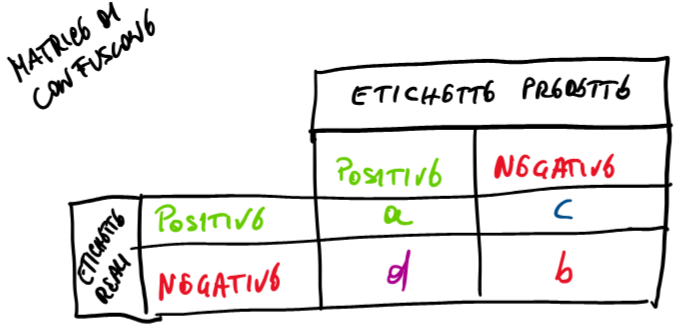
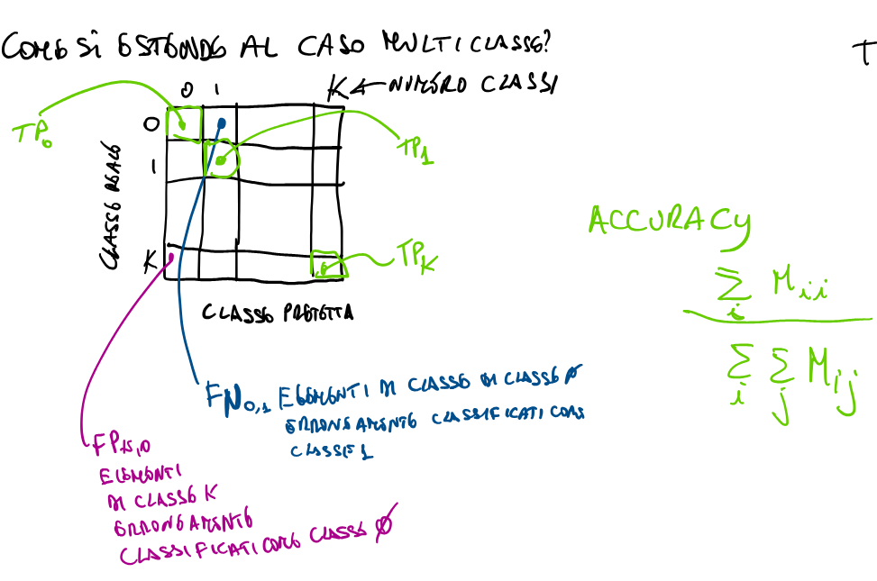

# Martedì 29 aprile 2025

## 🧠 Obiettivo:

Nel gradient descent standard, aggiorni i pesi $\theta_j$ per minimizzare una funzione di costo.
Quando aggiungi la **regolarizzazione**, vuoi anche **penalizzare i pesi grandi** per evitare overfitting.

---

> **"Nell'algoritmo di discesa del gradiente si aggiunge la derivata del termine di regolarizzazione per tutti i $v_j$ con $j \neq 0$"**

👉 Questo significa:

* Il termine di **regolarizzazione** si applica **solo ai pesi** $v_1, ..., v_d$ e **non al bias** $v_0$ (o $\theta_0$), che **non va penalizzato**.

---

## 🔁 Struttura dell’algoritmo:

Per ogni iterazione del **gradient descent** si aggiornano i coefficienti così:

### 🟩 **Bias (j = 0):**

$$
v_0^{\text{new}} \leftarrow v_0^{\text{old}} - \alpha \cdot \frac{1}{m} \sum_{i=1}^{m} \left( h_v(x^{(i)}) - y^{(i)} \right)x_0
$$

* Questo è lo **standard update** per il bias (nessuna regolarizzazione).
* Di solito $x_0 = 1$.

---

### 🟩 **Altri pesi (j ≠ 0):**

$$
v_j^{\text{new}} \leftarrow v_j^{\text{old}} - \alpha \left[ \frac{1}{m} \sum_{i=1}^{m} \left( h_v(x^{(i)}) - y^{(i)} \right)x_j + \frac{\lambda}{m} v_j \right]
$$

* C'è il **termine classico del gradiente** (primo termine della somma).
* E in più un **termine di regolarizzazione** $\frac{\lambda}{m} v_j$ che tende a "restringere" i pesi verso zero.
* $\lambda$ è il coefficiente di regolarizzazione (più è grande, più i pesi vengono penalizzati).

---

## 📦 Funzione costo (non mostrata ma implicita):

Questa derivata deriva da una **loss con regolarizzazione**:

$$
J(\theta) = \frac{1}{m} \sum_{i=1}^{m} \left( h_\theta(x^{(i)}) - y^{(i)} \right) + \frac{\lambda}{2m} \sum_{j=1}^{d} \theta_j^2
$$

* Il secondo termine è la **penalità** (regolarizzazione L2).
* La derivata rispetto a $\theta_j$ include $+ \frac{\lambda}{m} \theta_j$ (da cui il termine nell'aggiornamento).

---

## 💡 Conclusione:

Questo è un algoritmo di **gradient descent con regolarizzazione L2** (tipica della **Ridge Regression** o **logistic regression regolarizzata**).

* ✅ $\theta_0$: aggiornato normalmente (senza penalizzazione).
* ✅ $\theta_j$, con $j \neq 0$: aggiornato con penalizzazione.
* ✅ Serve a **limitare l’overfitting** penalizzando i pesi grandi.
* ✅ La regolarizzazione è controllata da $\lambda$.

---

## 🧠 **Stochastic Gradient Descent (SGD)**

### 📌 **Osservazioni iniziali**

> “La discesa del gradiente completa (GD) usa tutti i campioni del training set.”

➡️ Nel **Gradient Descent classico**, ad **ogni iterazione** bisogna calcolare il **gradiente della funzione di costo su tutti i dati**.
Questo diventa **computazionalmente costoso** per dataset molto grandi.

---

### 📉 **Problema di scalabilità**

> “La somma dei residui coinvolge m termini ad ogni iterazione.”

* Se hai $m$ campioni, ad ogni passo devi sommare $m$ termini per calcolare il gradiente.

#### Esempio pratico:

* $m = 100.000$ campioni
* $100$ iterazioni → ogni iterazione deve analizzare tutti i 100.000
  ➡️ In totale:

$$
m \times \text{iterazioni} = 100.000 \times 100 = 10.000.000 \quad \text{osservazioni processate}
$$

Se invece $m = 1.000.000$ campioni:

$$
100 \times 1.000.000 = 100.000.000 \quad \text{osservazioni!}
$$

### ⚠️ Questo è molto lento!

---

## ⚡ **Soluzione: Stochastic Gradient Descent**

> 🦸‍♂️ **“Stochastic is super hero!”**

* Invece di usare **tutti** i campioni ad ogni iterazione, ne **campiona uno o pochi** (mini-batch) per calcolare un'approssimazione del gradiente.

### ✳️ Procedura:

#### 1. **Campiona random** un sottoinsieme dei dati

– Un piccolo **batch** di punti del training set.

#### 2. **Esegui una singola iterazione** di gradient descent

– Calcola il gradiente **solo** su quei punti campionati.

#### 3. **Aggiorna i pesi** e **ripeti** finché non convergi

– Continua finché non arrivi a una minima variazione nella funzione di costo.

> Questo metodo è più **veloce**, anche se meno preciso a ogni iterazione → ma converge bene nel lungo termine.

---

Uno degli algoritmi fondamentali per l’ottimizzazione nei modelli di machine learning è il **Gradient Descent** (GD), che consiste nell’aggiornare iterativamente i pesi del modello nella direzione opposta al gradiente della funzione di perdita. Tuttavia, un grande svantaggio del gradient descent standard è il **costo computazionale**, perché ad ogni iterazione è necessario calcolare il gradiente **su tutto il dataset**. Questo può diventare estremamente oneroso, soprattutto con dataset molto grandi.

Per migliorare l’efficienza, si utilizza una variante chiamata **Stochastic Gradient Descent (SGD)**. A differenza del GD classico, che usa tutti i dati contemporaneamente, lo **SGD aggiorna i pesi del modello utilizzando solo un piccolo sottoinsieme casuale dei dati**, chiamato **batch**. Il batch viene selezionato casualmente ad ogni iterazione, e la sua dimensione – detta **batch size** – è di solito una potenza di due (ad esempio 32, 64 o 128). Questo approccio consente di **ridurre significativamente il carico computazionale**, pur mantenendo l’efficacia dell’ottimizzazione.

Dal punto di vista del costo, se denotiamo con $m$ la dimensione del dataset, $b$ la batch size e $e$ il numero di epoche, allora il numero di aggiornamenti da fare sarà proporzionale a $\frac{m}{b} \cdot e$. Poiché $b \ll m$, questo significa che **SGD ha un costo molto inferiore rispetto al GD**, che richiede $m \cdot e$ aggiornamenti completi.

Un aspetto importante da considerare è il **learning rate**, cioè la velocità con cui vengono aggiornati i pesi. Esiste una relazione tra batch size e learning rate: **man mano che aumenta la batch size, è possibile aumentare proporzionalmente anche il learning rate**. Questo perché batch più grandi forniscono una stima del gradiente più precisa e meno rumorosa. Di conseguenza, si può fare un passo più lungo nella direzione giusta, senza rischiare di divergere.

Un parametro critico è il rapporto $\frac{\alpha}{b}$, dove $\alpha$ è il learning rate e $b$ la batch size: **più è alto questo rapporto, maggiore è la probabilità di raggiungere la convergenza** in modo stabile ed efficiente. 

---

Uno dei principali problemi del **Gradient Descent (GD)** è legato alla scelta del **learning rate**, cioè il passo con cui aggiorniamo i pesi del modello. L’aggiornamento dei pesi avviene secondo la formula:

$$
\theta_{\text{new}} = \theta_{\text{old}} - \alpha \cdot \nabla_\theta J(\theta)
$$

dove $\alpha$ è il learning rate e $\nabla_\theta J(\theta)$ rappresenta il gradiente della funzione di perdita rispetto ai pesi.

Il primo problema è che **scegliere il valore giusto del learning rate è difficile**:

* Se è troppo piccolo, l’algoritmo convergerà lentamente.
* Se è troppo grande, rischia di **saltare il minimo** della funzione di perdita e divergere.
  
La soluzione ideale sarebbe un learning rate che sia **alto quando siamo lontani dal minimo** e che **si riduca gradualmente** man mano che ci avviciniamo.

Un secondo problema è quello di **rimanere intrappolati in un minimo locale**, specialmente in funzioni di perdita complesse. Una soluzione efficace è usare una tecnica chiamata **momentum**.

---

### 🔁 Momentum

Il **momentum** è un meccanismo di "memoria breve", che tiene conto della direzione degli aggiornamenti precedenti. Si introduce un parametro $\beta$ (solitamente intorno a 0.9) che pesa il contributo del passo precedente. La formula aggiornata diventa:

$$
z_{\text{new}} = \beta \cdot z_{\text{old}} + \nabla_\theta J(\theta)
$$

$$
\theta_{\text{new}} = \theta_{\text{old}} - \alpha \cdot z_{\text{new}}
$$

Questo consente al modello di **mantenere la direzione** se sta già convergendo, anche quando il gradiente attuale è piccolo o nullo. In pratica, **aiuta a uscire dai minimi locali** e a evitare oscillazioni.

---

### 📉 Adattamento del Learning Rate

Negli algoritmi più moderni, non si usa un learning rate fisso. Esistono diverse tecniche che permettono di **adattarlo dinamicamente** durante l'addestramento:

* **Adagrad**: assegna **learning rate più piccoli** ai parametri che ricevono aggiornamenti frequenti e **più grandi** a quelli aggiornati raramente. Questo consente una **convergenza più rapida** per i parametri meno influenzati e maggiore **stabilità** per quelli più attivi.

* Questo accade perché alcuni pesi sono associati a **feature molto presenti nei dati**: il loro gradiente viene calcolato più spesso, quindi devono essere aggiornati con cautela (learning rate piccolo).

* **Adam**: è un algoritmo ancora più sofisticato, che **combina Adagrad con il momentum**. Assegna automaticamente **learning rate diversi a ogni parametro**, tenendo conto sia della **frequenza degli aggiornamenti**, sia della **direzione passata** del gradiente.

---

### ✅ In sintesi

| Problema                             | Soluzione                               |
| ------------------------------------ | --------------------------------------- |
| Learning rate difficile da scegliere | Tecniche adattive come Adagrad o Adam   |
| Rischio di rimanere in minimi locali | Momentum (con parametro $\beta$)        |
| Convergenza lenta o instabile        | Learning rate dinamico, batch, momentum |

## Osservazioni

- $b \equiv$ numero di campioni nel **mini-batch** (bellatch size)  
- $\alpha \equiv$ **learning rate**  
- $e \equiv$ numero di **epoche** (iterazioni SGD)  
- $m \equiv$ numero di **campioni**

Ad ogni epoca si aggiornano i pesi.

$$
\frac{m}{b} = \text{numero di batch da considerare per ogni epoca} \Rightarrow \lfloor\frac{m}{b}\rfloor \text{ iterazioni per epoca}
$$

$$
e \cdot \frac{m}{b} = \text{Iterazioni totali}
$$

---

- Minibatch **grandi** permettono di stimare meglio il gradiente  
  (più è grande $b$, più ci si avvicina al gradiente di $J(\vec{\theta})$ sull'intero set di dati)

- Più grande è il batch, più grande e **stabile** può essere lo step da fare nel gradiente (cioè $\alpha$)

#### Scaling:

- $b \cdot K \rightarrow \alpha \cdot K$ → **Linear scaling** aumento il learning rate

- $b \cdot K \rightarrow \alpha \cdot \sqrt{K}$ → **Alternativa allo scaling** per velocizzare la convergenza

---

## Model Evalutation

$$
J(\vec{\theta}) = \text{funzione ottimizzazione parametri regolarizzata (calcolata sul training)}
$$

- $J_{\text{train}}$: uguale a $J(\vec{\theta})$ ma **non** include il termine di regolarizzazione (calcolata sul training set)  
- $J_{\text{val}}$: uguale a $J(\vec{\theta})$ ma **non** include il termine di regolarizzazione (calcolata sul validation set)  
- $J_{\text{test}}$: calcolata sul test set. Uguale a $J(\vec{\theta})$ ma **non** considera il termine di regolarizzazione

---

$$
J_{\text{error}} = \frac{1}{m} \sum_{i=1}^{m} \text{Error} \left( h_{\vec{\theta}}(x^{(i)}), y^{(i)} \right)
$$

👉 $\text{Misclassification error} =$ frazione dei pattern erroneamente classificati

---

$$
\text{Error} \left( h_{\vec{\theta}}(x^{(i)}), y^{(i)} \right) =
\begin{cases}
1 & \text{if } \left( h_{\vec{\theta}}(x^{(i)}) \geq 0.5 \land y^{(i)} = 0 \right) \lor \left( h_{\vec{\theta}}(x^{(i)}) < 0.5 \land y^{(i)} = 1 \right) \\
0 & \text{if } \left( h_{\vec{\theta}}(x^{(i)}) \geq 0.5 \land y^{(i)} = 1 \right) \lor \left( h_{\vec{\theta}}(x^{(i)}) < 0.5 \land y^{(i)} = 0 \right)
\end{cases}
$$

## Matrice di Confusione

## Definizioni e Obiettivi

**Goal:**  
Vogliamo che $a$ e $b$ siano grandi, mentre $c$ e $d$ siano piccoli  
(in altre parole: massimizzare le classificazioni corrette)

---

### Significato delle variabili:

- $a$: numero di campioni di classe positiva **classificati come positivi**  
  ⇒ **Veri Positivi** → $TP = \frac{a}{a + c}$

- $b$: numero di campioni di classe negativa **classificati correttamente come negativi**  
  ⇒ **Veri Negativi** → $TN = \frac{b}{b + d}$

- $c$: numero di campioni positivi **classificati erroneamente come negativi**  
  ⇒ **Falsi Negativi** → $FN = \frac{c}{a + c}$

- $d$: numero di campioni negativi **classificati erroneamente come positivi**  
  ⇒ **Falsi Positivi** → $FP = \frac{d}{b + d}$

---

### Totali:

- $a + c =$ totale dei **campioni positivi** nella banca dati di test  
- $d + b =$ totale dei **campioni negativi** nella banca dati di test

---

### Proprietà:

$$
TP + FN = 1
$$

$$
TN + FP = 1
$$

## Accuracy

$$
\text{Accuracy} = \frac{a+b}{a+b+c+d}
$$

Indica la percentuale dei campioni classificati correttamente.

Bisogna avere test bilanciati sul numero di campioni delle diverse classi, non è sempre possibile ma bisogna tenerne conto in fase di valutazione.

## Classificazione Multiclasse

## 🔢 **Matrice di confusione multi-classe**

Ogni riga rappresenta la **classe reale** di un campione, mentre ogni colonna rappresenta la **classe predetta**. La cella $M_{ij}$ contiene il numero di esempi della **classe reale $i$** classificati come **classe $j$**.

---

### 📌 **Elementi chiave della matrice:**

* **$M_{ii}$**: elementi correttamente classificati della **classe $i$**
  → chiamati anche **True Positives (TP)** per ciascuna classe

* **$M_{ij}$ con $i \ne j$**: elementi **erroneamente classificati**
  → ad esempio, $FP_{k \rightarrow 0}$ rappresenta gli esempi **della classe $k$** erroneamente classificati come **classe $0$**

* **$FN_{0,1}$**: esempi della **classe 0** erroneamente classificati come **classe 1**

---

## ✅ **Accuratezza (Accuracy)**

L'accuracy nel caso multi-classe è definita come:

$$
\text{Accuracy} = \frac{\sum_i M_{ii}}{\sum_i \sum_j M_{ij}}
$$

### Interpretazione:

* **Numeratore**: somma di tutte le classificazioni corrette (diagonale principale)
* **Denominatore**: totale degli esempi classificati (somma di tutti gli elementi nella matrice)

---

## 🧠 Estensione concettuale:

L'obiettivo rimane **massimizzare gli elementi sulla diagonale** (cioè le classificazioni corrette per ogni classe), e **minimizzare quelli fuori diagonale**, che rappresentano errori di classificazione.

Questo schema è utile per calcolare anche **precision**, **recall**, **F1-score** per ogni classe separatamente, se necessario.

---

## 🎯 **Precision**

> Misura la proporzione di esempi classificati come **positivi** che sono effettivamente **positivi**.

$$
\text{Precision}_{\text{classe}} = \frac{\text{True Positive}_{\text{classe}}}{\text{True Positive}_{\text{classe}} + \text{False Positive}_{\text{classe}}}
$$

> 🔍 Più è alta, meno **falsi allarmi** (falsi positivi) ci sono.

---

## 🔁 **Recall (Sensibilità)**

> Misura la proporzione di esempi **effettivamente positivi** che sono stati **correttamente identificati** come tali.

$$
\text{Recall}_{\text{classe}} = \frac{\text{True Positive}_{\text{classe}}}{\text{True Positive}_{\text{classe}} + \text{False Negative}_{\text{classe}}}
$$

> 🔍 Più è alta, meno **positivi sfuggiti** (falsi negativi) ci sono.

---

## ⚖️ **F1-Score**

> Rappresenta la **media armonica** tra **precision** e **recall**, utile quando le due sono sbilanciate.

$$
F_1 = 2 \cdot \frac{\text{precision} \cdot \text{recall}}{\text{precision} + \text{recall}}
$$

> 🔍 Utile quando l'equilibrio tra falsi positivi e falsi negativi è importante.

---

## ✅ **Accuracy**

> Percentuale di **predizioni corrette** sul totale dei campioni.

$$
\text{Accuracy}(Y, \hat{Y}) = \frac{|\{ i : y^{(i)} = \hat{y}^{(i)} \}|}{|Y|}
$$

> 📉 Non è affidabile quando le **classi sono sbilanciate** (es. malattie rare): può essere alta anche se il modello non identifica **nessun positivo**.

---

## 📉 **Curva Precision-Recall**

Varia il **threshold (soglia di decisione)** da 0 a 1, e osserva come cambiano precision e recall. La curva mostra il trade-off tra i due:

* Quando la **soglia è alta**, il modello è più cauto → più **precision**, meno **recall**
* Quando la **soglia è bassa**, il modello è più permissivo → più **recall**, meno **precision**

> 🔍 **Un buon modello** avrà una curva vicino all'angolo in alto a destra.

---

## 🔄 **Trade-off tra Precision e Recall**

* Se aumenti **recall**, rischi più **falsi positivi** → precision cala
* Se aumenti **precision**, rischi più **falsi negativi** → recall cala

---

